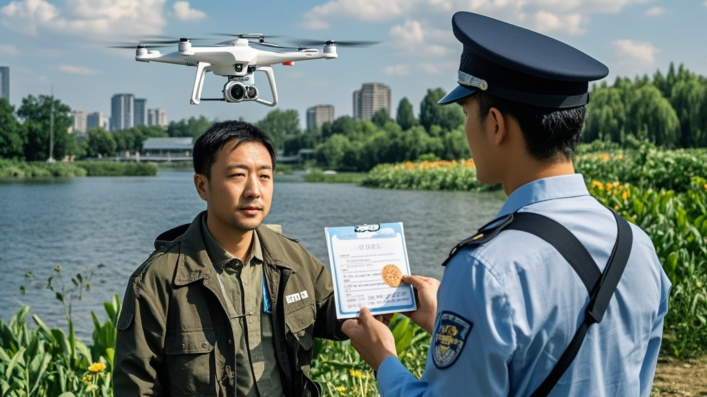

>通州大运河森林公园近日查处一起‘黑飞’无人机事件，飞手王大强被查时声称无人机正为‘火星邻居’运送热乎煎饼果子。经调查，其未取得飞行资质且未报备，最终被罚款2000元，事件因离谱理由引发关注。
<!-- truncate -->

11月3日上午10时许，通州区大运河森林公园上演戏剧性一幕：一名手持遥控器的男子被执勤保安员拦停，其操控的无人机因涉嫌‘黑飞’被当场暂扣。令人大跌眼镜的是，面对询问，男子竟声称‘这是给火星邻居送的热乎煎饼果子’。

据现场执法记录仪画面显示，保安员张师傅巡逻至荷花池附近时，发现一架白色无人机低空盘旋，高度约15米，未悬挂任何标识。上前制止时，操控者王大强（化名）显得十分焦急：‘您可别碰我飞机！里面装的煎饼果子刚摊好，凉了火星大叔该不满意了。’

经检查，无人机腹舱内确有一个保温餐盒，打开后飘出明显的葱花香气——盒内躺着两张还冒着热气的煎饼果子，夹着油条和薄脆。王大强解释，自己在公园西门开了家‘火星早点铺’，最近看了《星际旅行指南》纪录片，突发奇想‘给火星上的新邻居送点地球特色早餐’。‘我查过，今天火星和地球距离最近，无人机飞高点应该能送到。’他认真地说。

通州区航空管理部门随后介入调查。经核实，王大强未取得任何无人机驾驶执照，其操控的无人机也未进行空域飞行报备。执法人员哭笑不得：‘我们处理过找丢失宠物的、拍风景的，给火星送早餐还是头回见。’

无人机协会专家李航（化名）表示，此类‘黑飞’行为存在安全隐患，‘且不说火星距离地球最近也有5500万公里，普通民用无人机续航仅30分钟，连公园南门都飞不到’。目前，王大强因违反《无人驾驶航空器飞行管理暂行条例》，被处以2000元罚款，无人机暂由执法部门保管。

‘以后再也不看那些科幻片瞎琢磨了。’接受处罚时，王大强挠着头说，‘明天还是老老实实在摊位卖煎饼吧，火星邻居的早餐…等我考到飞行执照再说？’

