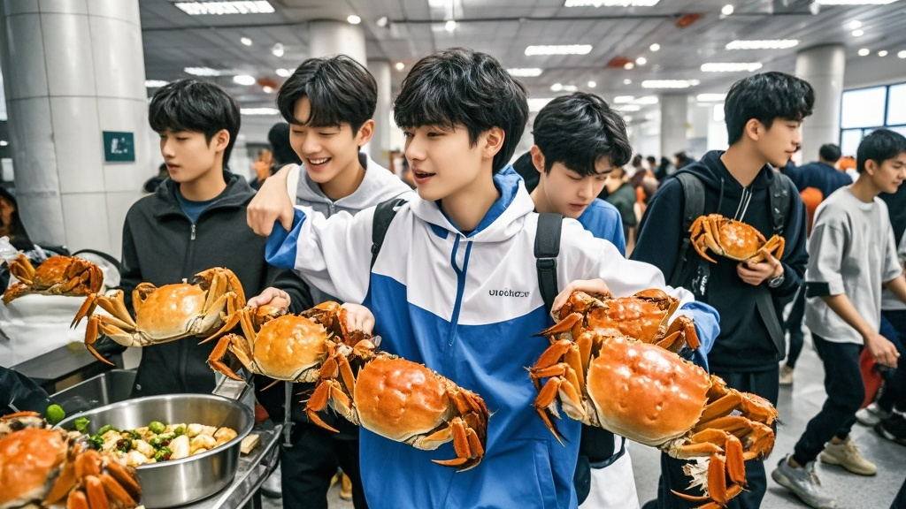

>东湖大学食堂8.8元螃蟹引发万人疯抢，因供应商价格标错陷入‘蟹荒’，校方紧急组织学生赴阳澄湖现抓螃蟹，途中状况频出，上演校园版‘抢蟹奇谭’。
<!-- truncate -->

近日，东湖大学第三食堂因8.8元一只的‘亲民螃蟹’火上热搜，原本平静的校园食堂瞬间变身‘战场’。据现场学生反映，自11月2日起，食堂窗口前每天清晨5点便排起长队，队伍从二楼蜿蜒至操场，甚至有学生带着折叠椅、保温箱彻夜守候。

后勤处张主任在接受采访时苦笑：‘我们原本只是想给学生改善伙食，谁能想到这螃蟹比双十一秒杀还疯！’据其透露，这批螃蟹原计划是‘秋季限定福利’，仅供应3天共5000只，但首日上午10点便被抢购一空，第二天更有校外人士混进校园‘蹭蟹’。

更戏剧化的是，供应商昨日紧急发来‘价格澄清函’，称因系统故障将88元/只的‘阳澄湖精品蟹’错标为8.8元，要求校方补差价。张主任表示：‘我们查了监控，发现学生们为抢螃蟹连课都翘了，总不能让孩子们寒心吧？’

为解决‘蟹荒’，校方连夜召开紧急会议，最终拍板‘阳澄湖突击采购计划’——包下3辆大巴，组织20名学生代表、5名食堂师傅，携带‘东湖大学采购专用网兜’奔赴阳澄湖现抓现运。

然而计划刚执行便状况频出：学生代表小王因没带雨靴，下湖10分钟就摔了3跤；食堂李师傅用专业蟹钳夹蟹时，反被一只‘反抗激烈’的大闸蟹夹住手指，最终靠涂蜂蜜才诱其松钳。截至发稿，首批‘手抓蟹’已运抵校园，但因运输途中螃蟹‘集体越狱’，实际到货量比预计少了三分之一。

面对这场‘螃蟹引发的校园奇事’，社会学教授陈老调侃：‘这哪是买螃蟹，分明是当代大学生的‘生存演习’。’而学生们则表示：‘8.8元的螃蟹可能没了，但和同学凌晨排队、抓螃蟹的经历，够我们聊四年了！’

