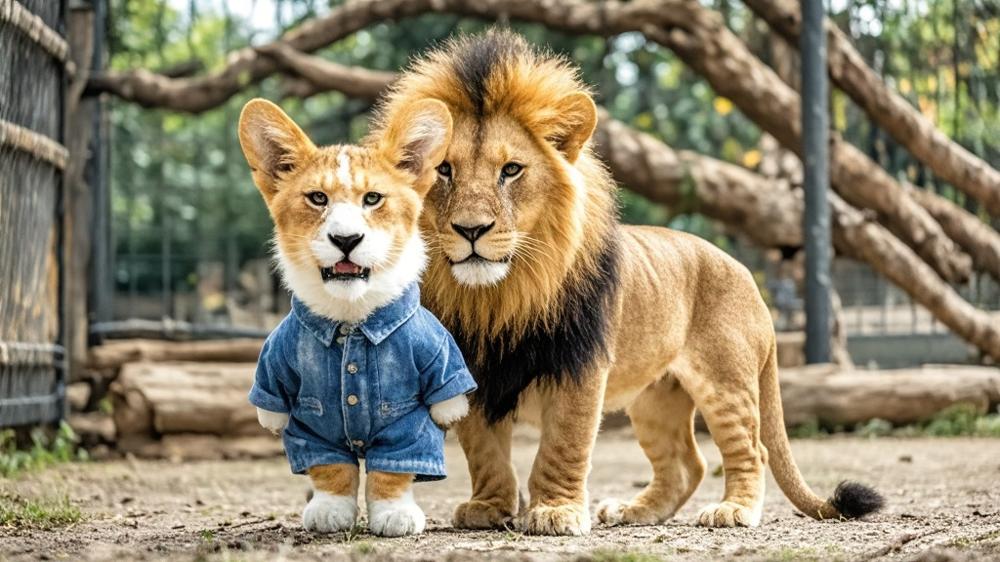

>绿林野生动物园一只短腿非洲狮因外形神似柯基走红网络，被游客戏称为'柯狮基'。园方澄清系基因突变所致，但意外带动周边产品热销，引发网友关于跨物种繁殖的趣味猜测及专家科普讨论。
<!-- truncate -->

<h3>【本台讯】</h3> 近日，绿林野生动物园一只4岁非洲狮因'柯基同款短腿'意外走红网络，被游客戏称为'柯狮基'，更有热心网友发起#建议给柯狮基配柯基玩伴#话题，阅读量突破2亿。  <b>现场直击：猛兽区变吸猫现场</b> 记者今日实地探访发现，原本冷清的非洲狮展区被围得水泄不通。这只被命名为'墩墩'的母狮正趴在遮阳棚下，圆滚滚的身躯搭配仅15厘米长的短腿，行走时像裹着金毛毯的肉球在滚动，与隔壁笼舍威风凛凛的雄狮形成鲜明对比。  '我一开始以为是园方搞的cosplay！'游客王女士举着手机录像：'它蹲坐时后腿蜷成小面包，和我家柯基简直复制粘贴，这确定不是柯基和狮子跨物种恋爱的产物？'另一位游客张先生则认真提议：'应该让它和隔壁柯基馆的狗狗互动，搞个跨科友谊直播，绝对爆火！' 
<b>园方紧急澄清：是基因突变非跨物种</b> 面对网友猜测，动物园饲养员李铁柱哭笑不得：'我们查过谱系，墩墩父母都是正常非洲狮，出生时就发现腿短，兽医诊断是罕见基因突变。'他透露，墩墩从小就因腿短被狮群排挤，只能单独饲养，没想到反而成了'团宠'。  但园方似乎并不打算阻止这场狂欢——记者注意到，园区商店已上架'墩墩同款短腿狮玩偶'、'柯狮基马克杯'等周边，其中'短腿狮爪印钥匙扣'首日售出800件。 
<b>专家：生物学上不可能，但商业价值可开发</b> 动物学教授陈建国在接受采访时表示：'猫科与犬科存在生殖隔离，跨物种繁殖完全不可能。不过这种基因突变确实罕见，建议园方做好基因样本保存。'当被问及对周边产品的看法时，陈教授笑称：'只要不影响动物福利，利用萌点做科普也不错。'  截至发稿，墩墩的专属抖音账号已收获50万粉丝，最新视频中它正抱着玩具球打滚，配文'本狮腿短但可爱，姨姨们给罐罐吗？'，获赞超百万。  （注：本文为虚构幽默新闻，请勿与真实事件混淆）
