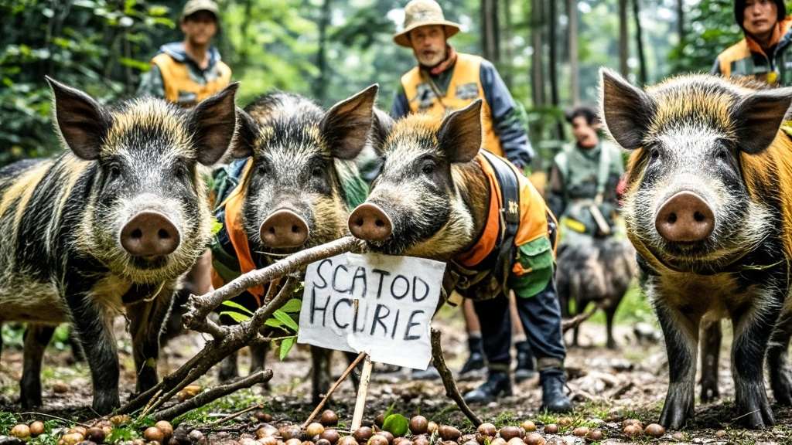

>湖南张家界荒野求生赛惊现奇闻，原本被选手追捕的野猪群突然展现'高智商'行为：用树枝摆标语、分工协作、主动投喂人类选手橡果，赛事方紧急修改规则应对'人猪互动新状况'。
<!-- truncate -->

<h3>本报张家界11月9日电（记者 山野）</h3>
正在湖南张家界七星山进行的荒野求生赛，于第32天上演戏剧性转折——原本被选手视为'移动肉库'的野猪群，竟被拍到用树枝摆出'禁止猎杀'标语，并向人类选手投喂橡果。

据赛事直播画面显示，昨日清晨6时许，编号07的选手'张大胆'在灌木丛后发现3头野猪。正当他悄悄摸向随身携带的石制捕猎器时，为首的黑背野猪突然用前蹄扒拉地面，竟在泥地上划出歪歪扭扭的'别追我'三个大字。

'当时我以为饿出幻觉了，揉了三次眼睛！'张大胆在赛后采访中仍难掩震惊，'更离谱的是，那猪接着又拱来一堆橡果，堆成小塔状，旁边还摆了片大树叶当'餐盘'。'

赛事方紧急调取30个隐藏摄像头画面，发现自前日起，野猪群已出现异常行为：用獠牙搬运枯树枝搭建简易'哨塔'，用鼻子推动石头在空地上拼出'和平共处'字样，甚至有两头小猪崽模仿选手用石块摩擦取火（尽管最终只冒了点烟）。

动物行为学专家王建国（化名）通过直播录像分析：'从野猪的肢体语言看，它们可能将人类选手的捕猎行为理解为'游戏'，但这种'拟人类'互动超出了现有动物行为研究范畴。更值得关注的是，野猪群似乎建立了简单的分工体系——两头壮猪负责警戒，母野猪带领幼崽收集食物，完全颠覆了传统认知中野猪'散兵游勇'的形象。'

目前赛事方已召开紧急会议，决定临时修改规则：选手每日可接受野猪'馈赠'的食物，但禁止主动发起捕猎行为。'我们现在最担心的是，'赛事总监李铁柱（化名）苦笑，'要是野猪学会用对讲机，这比赛可能得改名叫'人猪生存交流会'了。'

截至发稿，已有7名选手收到野猪'投喂'的橡果、野栗子等食物，其中2名选手甚至收到用藤蔓捆扎的'鲜花'（经鉴定为当地常见的野菊）。而原本因食物短缺濒临退赛的1名女选手，更因收到野猪送来的蜂窝（内含少量蜂蜜），当场激动得与野猪'击掌'（实际是用树枝轻碰猪鼻子）。

