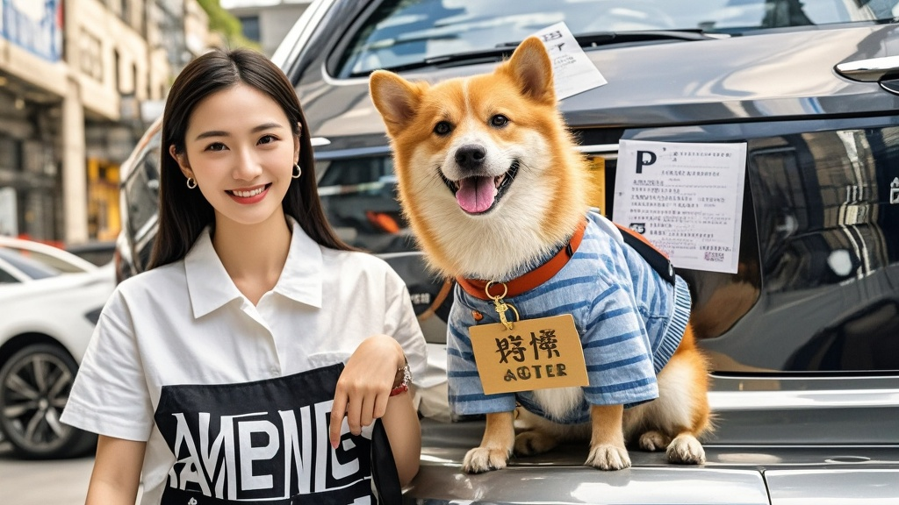

>市民李小花为避免违停贴条，让宠物狗旺福挂‘求不贴条’牌子守车，结果仍被贴条。狗狗‘尽力护主’的画面意外走红，引发品牌关注和网友热议，上演了一出‘萌犬抗贴条反成网红’的荒诞喜剧。
<!-- truncate -->

近日，市民李小花在社区公共卫生间旁上演的‘人犬协作抗贴条’事件，意外让自家宠物狗‘旺福’成了本地社交平台顶流。
 
据李女士回忆，11月7日下午她因内急，将车临时停在卫生间5米外的非停车位。为避免被贴条，她灵机一动用红纸板写了‘警察叔叔行行好，我主人就去两分钟’，用狗绳系在旺福脖子上，‘想着狗狗这么可爱，交警看到肯定心软’。
 
然而15分钟后返回时，挡风玻璃上已端端正正贴着罚单。正当李女士蹲地苦笑时，路过的小学生用手机拍下旺福‘举牌凝视罚单’的画面，配文‘毛孩子尽力了’，视频当晚播放量突破200万。
 
更戏剧性的转折出现在次日——某宠物食品品牌联系李女士，称旺福‘委屈又尽责’的表情完美契合新品‘贴心小棉袄’狗粮的宣传理念；某交通志愿组织则邀请旺福担任‘文明停车形象犬’，计划制作‘萌爪劝停’系列公益海报。
 
面对突然走红，李女士哭笑不得：‘昨天遛狗时遇到贴条的王警官，他偷偷告诉我，其实当时看到旺福举牌，同事们都憋笑憋得脸通红。但系统自动派单，不贴条要扣绩效。’她顿了顿补充，‘最离谱的是，我家旺福这两天看到穿制服的就凑过去摇尾巴，难不成真把举牌当职业了？’
 

截至发稿，旺福的社交账号已收获3.8万粉丝，最新动态是它趴在写有‘下次一定停车位’的新牌子旁，配文‘汪~这次保证不坑主人’。

