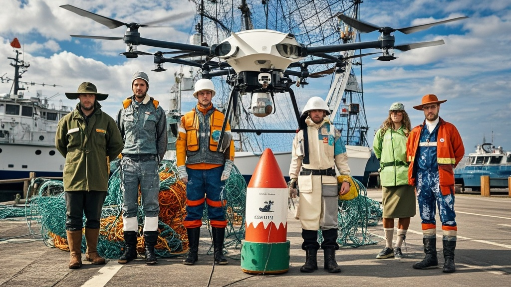

>欧洲多国渔民组成‘北大西洋旧渔具救援联盟’，宣称通过‘纳米涂层’‘鱼油浸泡’等技术改造旧渔网，使其具备拦截无人机、吸附导弹热量甚至制作‘反导蛋糕’等‘军事功能’，引发国际军事专家质疑与民间抢购鱼油热潮。
<!-- truncate -->

<h3>本报布鲁塞尔讯（记者 欧小渔）</h3> 近日，由法国、瑞典、丹麦等国渔民自发组成的‘北大西洋旧渔具救援联盟’召开跨国新闻发布会，宣布一项重大军事科技突破——通过‘渔网纳米涂层技术’改造的旧渔网，将成为俄乌冲突中的‘终极防御神器’。  联盟发言人、瑞典渔民代表奥拉夫·海钓手在发布会上展示了改造后的旧渔网： <i>‘我们收集了280公里长的废弃渔网，用北海鳕鱼鱼油浸泡24小时，再喷涂从挪威三文鱼罐头厂回收的银色涂层，最后用冰岛火山灰进行‘硬化处理’。现在它不仅能拦截无人机螺旋桨，还能吸附导弹尾焰热量！’</i>  现场演示环节更令人咋舌：工作人员用改造渔网包裹模拟坦克模型，竟成功‘抵御’了玩具无人机的‘攻击’；将渔网折叠成碗状，倒入热巧克力后，联盟竟宣称这是‘反导蛋糕’——<i>‘热量能干扰红外制导系统，巧克力香味还能迷惑俄军军犬！’</i>  乌克兰国防部顾问‘临时技术顾问’（化名）在视频连线中表示： ‘我们已接收首批500公斤改造渔网，前线士兵反馈良好——有人用渔网做防弹围巾，有人把渔网缝在头盔里当‘防碎片衬垫’，甚至有炊事班用渔网筛土豆泥，说比传统漏勺更‘防弹’。’ 
 不过，国际军事专家对此持保留态度。虚构的‘日内瓦和平装备研究所’研究员伊万·纸飞机指出： ‘渔网的抗拉强度确实能拦截低速无人机，但面对高速导弹时，其防护效果等同于‘用湿纸巾挡子弹’。至于‘反导蛋糕’，建议优先解决士兵的热食供应问题。’  联盟并未理会质疑，已启动‘渔网2.0计划’： ‘下一步我们将尝试用腌鲱鱼汁浸泡渔网，利用刺鼻气味干扰敌方通讯；再加入芬兰驯鹿毛，增强‘雪地隐身效果’。预计年底前可向乌方交付‘海陆空三栖防御渔网套装’。’  截至发稿，俄罗斯国防部暂未回应此‘新型武器’，但克里姆林宫附近超市的鳕鱼鱼油已被抢购一空。
