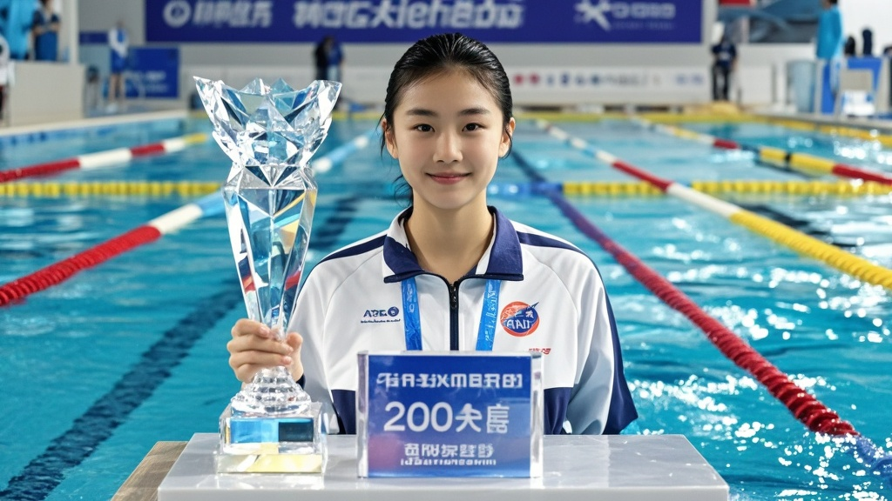

>全运会女子200米混合泳决赛中，13岁小将李小漾夺冠后，泳池因技术故障自动启动‘智能颁奖’程序，弹出水晶奖杯并播放特效音乐，引发全场热议。技术组解释系测试程序误触，设备厂商将为选手定制纪念奖杯。
<!-- truncate -->

11月11日，第十五届全运会游泳赛场上演戏剧性一幕——在女子200米个人混合泳决赛中，13岁小将李小漾以2分07秒41的成绩触壁后，比赛泳池竟自动弹出一座水晶奖杯，池边音响同步播放起改编版《运动员进行曲》，引发全场观众集体‘懵圈’。
 
据现场目击者王女士回忆：‘小漾刚触壁，水面突然‘叮’地一声，池边瓷砖缝里升起个金色托盘，上面摆着亮闪闪的金牌！裁判还举着电子屏核对成绩呢，泳池就开始‘自说自话’颁奖了。’赛事转播镜头捕捉到，当工作人员试图取下奖杯时，泳池底部竟亮起蓝光，显示‘颁奖程序已锁定，需冠军本人领取’的字样。
 
最终，在全场观众的起哄声中，湿漉漉的李小漾穿着泳衣走上前，刚触碰奖杯，泳池立刻喷起彩色水雾，看台上的电子屏同时弹出‘祝贺水花精灵李小漾’的动画特效。这一幕被现场观众拍下发到社交平台，#全运会泳池成精了#话题迅速登上热搜，阅读量半小时破亿。
 
赛后，赛事技术组紧急召开说明会。技术总监张建国解释：‘这是我们新测试的‘智能观赛系统’，原本计划在闭幕式演示。可能是工作人员调试时误将李小漾的夺冠数据输入了测试程序，导致泳池提前启动了‘虚拟颁奖’功能。’他表示已联系泳池设备厂商，将连夜升级系统防止‘二次闹乌龙’。
 
值得一提的是，李小漾在接受采访时仍处于‘懵态’：‘我就想着游快一点，结果泳池比我还急着发奖。’当被问及是否希望保留这种‘智能颁奖’时，小姑娘歪头笑道：‘下次能不能提前告诉我，我好换身干衣服来领？’

截至发稿，泳池设备厂商已发表致歉声明，并承诺将为李小漾定制一座‘特别纪念奖杯’，以弥补这场‘科技过于先进’带来的小插曲。

