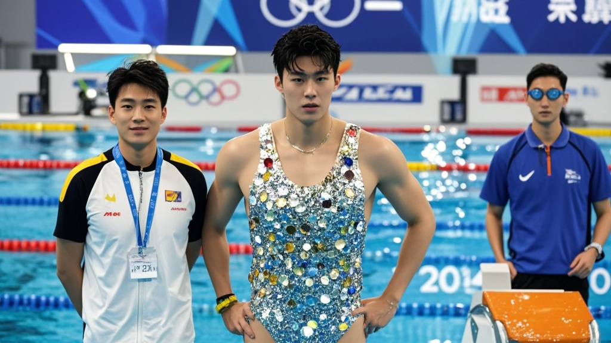

>全运会游泳男子200米自由泳预赛中，夺冠热门沈翔因泳衣亮片数量超300片且部分亮片直径超标，被裁判组用显微镜数三小时后取消成绩。赛事方称新规为「提升科技感」，但选手及教练表示毫不知情，引发网友对规则合理性的热议。
<!-- truncate -->

<h3>全运会惊现「亮片门」：科技感新规难倒夺冠热门</h3>
11月12日，第十五届全运会游泳赛场爆出离奇插曲——男子200米自由泳预赛中，夺冠大热门选手沈翔在冲线后仅1小时，被赛事裁判组紧急通知「因泳衣亮片数量违规」取消成绩。这一决定令现场观众和解说员集体懵圈。

据裁判组书面说明，本届全运会为「提升赛事科技感与视觉规范」，特别新增《游泳运动员参赛装备细则2024》，其中第7条明确规定：「参赛泳衣表面装饰亮片数量需为偶数，且不得超过300片；亮片直径统一为0.8cm±0.1cm，误差超过0.05cm视为违规」。经裁判组使用实验室级显微镜逐片清点，沈翔所穿泳衣亮片总数为301片，且其中3片直径达0.86cm，违反双项规定。

「我们从上午10点半开始数，轮流换了4个裁判，连放大镜都不够用，最后借了跳水队的水下摄像机才数清楚。」裁判组组长张建国在新闻发布会上解释，「虽然选手成绩优秀，但规则就是规则，必须一视同仁。」

面对突来的处罚，沈翔及其教练团队显得措手不及。沈翔表示：「平时训练只关注体能和技术，谁会数泳衣上的亮片？这泳衣还是队里统一发的，说是什么‘科技感设计’。」其教练李宏则拿出队服采购合同复印件：「供应商提供的质检报告写着‘亮片数量298±5’，我们完全按标准定制，现在突然说要精确到个位，这不是为难人吗？」

事件引发网友热议，#全运会亮片数裁判数了三小时#话题迅速登上热搜。有网友调侃：「建议下届比赛给裁判配自动计数机，或者直接规定‘禁止穿带亮片的泳衣’」；也有观众质疑：「游泳比的是速度，亮片数量和比赛公平性有半毛钱关系？」

截至发稿，赛事组委会尚未回应「为何赛前未公示该细则」的质疑，但已宣布「将组织专家团队重新评估装备规则合理性」。而沈翔的泳衣，目前正被封存在赛事博物馆，作为「科技感规则实践案例」展出。

