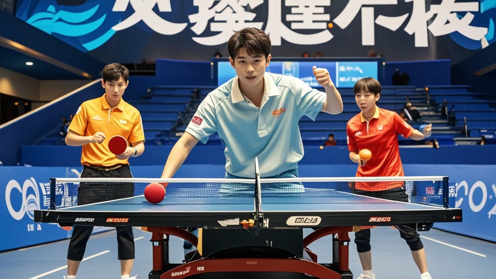

>全运会乒乓球半决赛中，新引进的‘智能调节球台’因程序乌龙，误装家用茶几系统，导致球台随击球力度自动调整角度，选手无奈上演‘追球游戏’，最终赛事方启用备用球台完成比赛。
<!-- truncate -->

11月13日，第十五届全运会乒乓球男单半决赛现场上演戏剧性一幕——主办方新引进的‘智能调节球台’突发程序错乱，导致球台角度随选手击球力度自动变化，原本激烈的对决秒变‘追球游戏’。
 
据现场观众描述，半决赛首局进行至5:5时，当选手陈飞一记正手爆冲将球击向对方球台左角，球台竟突然向上倾斜15度，乒乓球如弹珠般‘嗖’地弹向天花板，擦着裁判席吊灯坠落。‘这球反弹轨迹比我发球动作还讲究！’陈飞盯着球台愣在原地，对手赵阳也举着球拍不知所措。
 
赛事技术组紧急入场排查，发现问题根源竟出在球台控制系统——工程师误将家用智能茶几的‘重力感应调节’程序，安装到了专业比赛球台的操作系统中。‘两台设备型号都是ZNT-2025，我们以为只是尺寸差异……’技术组刘主任擦着汗解释，‘结果球台检测到击球力度超过阈值，就自动调整台面角度“保护桌体”。’
 
故障曝光后，现场观众席爆发阵阵笑声。有观众调侃：‘这球台比选手还会挑球打，轻的不接重的躲。’最终赛事方启用备用传统球台完成比赛，陈飞以4:2险胜赵阳晋级。赛后接受采访时，陈飞仍心有余悸：‘下次比赛前，建议先和球台签个“和平共处协议”，省得它突然闹脾气。’
 
截至发稿，赛事组委会已向全体选手致歉，并表示将给智能球台系统‘补课’——至少在决赛前，确保它学会‘只认乒乓球规则，不认茶几逻辑’。

