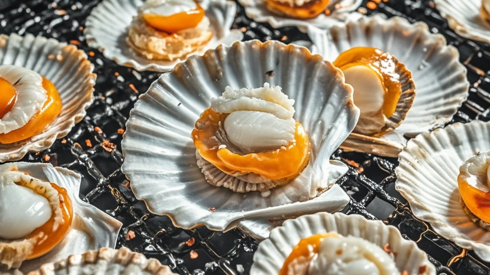

>记者调查发现部分烧烤店使用3D打印技术生产扇贝壳，搭配冷冻贝肉制成"组装扇贝"，商家推出定制壳服务，成本低至2分钱/个，引发消费者对食材真实性的热议。
<!-- truncate -->

近日，记者在走访本市餐饮市场时发现，一项"餐饮黑科技"正悄然改变烧烤摊的"扇贝江湖"——部分商家竟开始使用3D打印技术批量生产扇贝壳，搭配冷冻贝肉制成"组装扇贝"，更有商家宣称"壳都是私人定制款"。

在位于朝阳区的"金贝阁"烧烤店，记者以顾客身份询问蒜蓉粉丝扇贝的食材来源。穿花围裙的王师傅神秘一笑："现在谁还捡海里的旧壳？我们用的是最新3D打印扇贝壳！"他掏出手机展示打印车间视频，只见白色粉末在激光下层层堆叠，不到10分钟就"长"出一枚纹路清晰的扇形贝壳，"从菲律宾扇到大连紫扇贝，要什么纹路有什么纹路，连壳上的生长线都能调密度。"

据王师傅透露，这种打印壳成本低至2分钱/个，比此前用的半壳冻贝成本再降40%。更离谱的是，部分商家还推出"壳定制服务"：顾客可上传照片，打印带有生日日期、情侣名字的专属贝壳，"上周有个小伙子打印了带"娶你"二字的贝壳，说要在烧烤摊求婚，我们收了他88元定制费。"

记者随后走访淘宝发现，"烧烤专用3D打印扇贝壳"已形成完整产业链，某店铺客服介绍："我们有食品级树脂和可降解淀粉两种材质，树脂壳能重复用10次，淀粉壳烤完还能当肥料——不过建议用树脂的，毕竟要装热菜。"当被问及安全性时，客服发来"食品接触级检测报告"，但记者注意到报告落款竟是"XX县科技美容培训学校检测中心"。

对此，中国烹饪协会特邀研究员李实秋表示："虽然3D打印技术应用广泛，但用在扇贝壳上实在没必要。更关键的是，消费者吃扇贝时，图的就是"现开现烤"的新鲜劲，现在连壳都是工业产品，这和吃塑料壳配冷冻肉有什么区别？"

采访尾声，刚吃完两盘"定制贝壳扇贝"的市民张女士哭笑不得："我还说这壳比以前漂亮，原来是打印的！早知道省点钱，买俩贝壳钥匙扣得了。"

