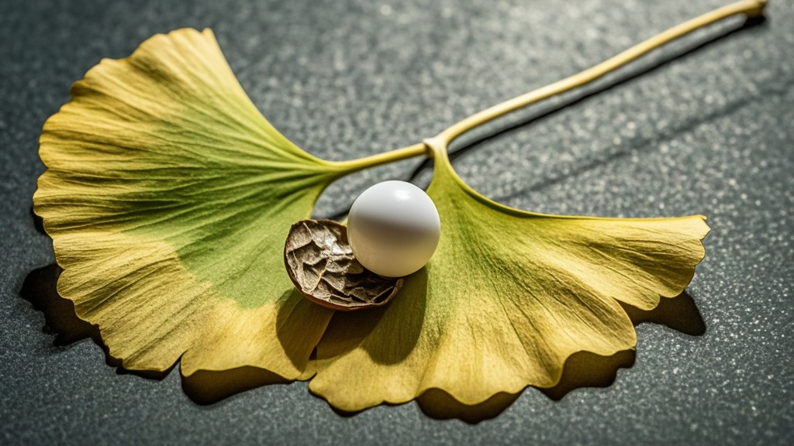

>全运会乒乓球女单决赛中，决胜局乒乓球意外裂开露出「会反弹的银杏种子」，经检测种子含特殊运动基因，赛事方紧急暂停比赛并启动植物保护程序，引发全网热议。
<!-- truncate -->

<h3>全运会乒乓球女单决赛突发离奇插曲</h3>
11月16日上午，第十四届全运会乒乓球女单决赛现场上演戏剧性一幕——当「孙小莎」与「王漫羽」激战至决胜局10:10时，一颗高速旋转的乒乓球突然在球台中央裂开，露出一枚泛着金色光泽的银杏种子，引发全场观众集体惊呼。

<h4>比赛暂停：种子被送实验室检测</h4>
据现场记者描述，裂开的乒乓球外壳呈均匀放射状裂痕，内部包裹的种子长约2厘米，表面布满类似乒乓球纹路的沟壑。裁判组立即启用「特殊事件处理预案」，暂停比赛并将种子送往赛事合作的「国家体育生物实验室」检测。

实验室负责人「张科」在赛后新闻发布会上表示：「初步检测显示，这颗种子含有罕见的『运动基因片段』，其表面沟壑与乒乓球摩擦痕迹高度吻合，疑似在长期运动中形成特殊适应性。更离奇的是，当用球拍轻触种子时，它竟能反弹出约30厘米的高度，与标准乒乓球反弹系数存在神秘关联。」

<h4>选手反应：「以为是训练用的智能球」</h4>
「孙小莎」在接受采访时仍难掩震惊：「我第一反应是队里新研发的智能训练球，结果裂开后闻到了植物清香。这颗种子要是发芽了，会不会长出会打乒乓球的小树苗？」「王漫羽」则幽默补充：「建议组委会给种子也发个『体育精神奖』，毕竟它坚持到了决胜局才暴露身份。」

<h4>组委会回应：将设立「运动植物保护基金」</h4>
全运会乒乓球项目负责人「李宏」宣布，经紧急磋商后，决赛结果将延迟至种子鉴定完成后公布，同时计划设立专项基金，用于研究「运动场景下的生物适应性」课题。「我们已联系林业部门，待确认种子品种后，将在赛场旁设立微型植物园，确保它能在适宜环境中生长。」

截至发稿，赛事官方微博#全运会乒乓球种子成精了#话题阅读量已突破2亿，网友调侃：「这届全运会不仅比球技，还比球的生命力」「建议下届比赛改用核桃，抗裂性更强」。

