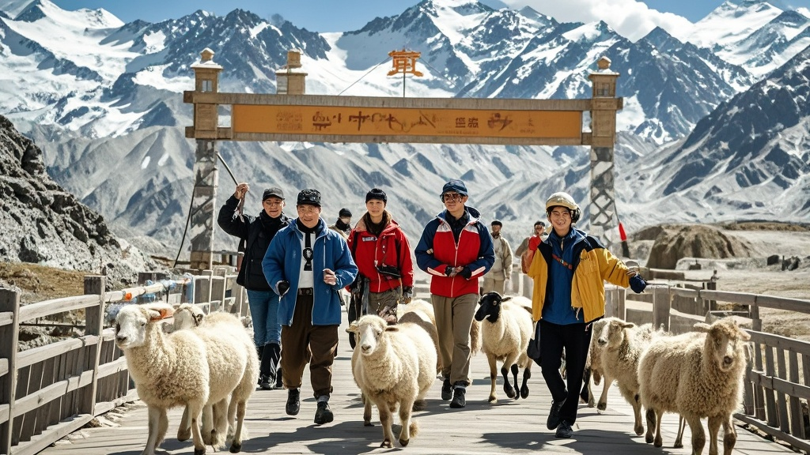

>某户外综艺《狂奔吧！骆驼》因导航错误误入新疆红其拉甫国门景区录制，不仅封闭栈道还要求游客当群演赶羊，最终被景区处罚并道歉，称系导航输入错误导致片场错位。
<!-- truncate -->

近日，新疆红其拉甫国门景区上演荒诞一幕——某户外综艺《狂奔吧！骆驼》节目组以"沉浸式拍摄"为由，不仅封闭游客栈道，更要求现场游客"配合录制"，引发大量游客投诉。

据游客张先生回忆，15日上午他按计划前往国门景区游览，却被工作人员告知"常规栈道因节目录制封闭"，只能退至10米外远观。正当他准备离开时，一名穿"导演助理"马甲的男子拦住他："哥，我们正拍游客偶遇骆驼群的戏，您帮忙赶下羊呗？一天给50块景区文创！" 张先生表示，当时现场有20多名游客被"分配任务"：有被要求举着"欢迎骆驼"牌子的，有被安排蹲在地上假装捡骆驼毛的，甚至有位穿高跟鞋的女士被要求"模仿骆驼走路"。更离谱的是，节目组还"征用"了游客的自拍杆当"跟拍设备"，称"真实游客视角更有代入感"。

下午3点，景区管理处接到多起投诉后介入。令人大跌眼镜的是，节目组负责人竟掏出地图道歉："实在对不住，我们本来要去隔壁县的牦牛谷拍摄骆驼主题，结果导航输错成红其拉甫国门了。"据查，该节目组此前已在3个景区出现类似"导航错误"：上周在草原拍"沙漠探险"，上上周在湖泊边拍"雪山攀登"。

截至发稿，景区已对节目组开出5万元罚单，并承诺向受影响游客赠送"无节目干扰游览券"。而《狂奔吧！骆驼》官微则发布致歉声明："下一站录制地我们将改用纸质地图+人工问路，确保不再发生'骆驼跑错片场'事件。"

