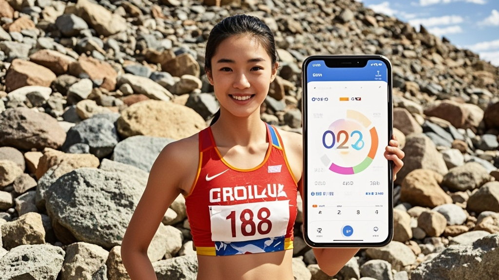

>16岁全运会女子百米冠军王小萌夺冠后，意外致谢三年前在新疆乱石堆遗落的智能手机。该手机保留的健身APP运动数据被教练团队发现与短跑训练模型契合，经模拟训练后助力其提升成绩，送还手机的牧民更计划将碎石滩打造成「天然训练基地」。
<!-- truncate -->

第十五届全运会田径赛场今日上演离奇一幕——16岁「短跑新苗」王小萌以11秒28的成绩摘得女子百米桂冠，赛后她竟公开致谢三年前在新疆乌孙古道乱石堆遗落的智能手机，称其「内置健身APP的运动数据」是夺冠关键。
 
据记者调查，2022年7月，时年13岁的王小萌随家人在新疆徒步时，不慎将手机遗落在碎石区。「当时以为彻底丢了，没想到上周惠州小区物业突然联系我，说有位新疆牧民在放羊时捡到了手机，还特意坐飞机送回来。」王小萌母亲陈雨在赛后采访中难掩激动。 

更令人称奇的是，这部在戈壁滩「流浪」三年的手机，竟完整保留着王小萌当时下载的「每日燃脂」APP数据。「我翻记录才发现，她徒步那天误开了『户外跑』模式，虽然手机没电关机，但重启后居然同步了2.3公里的碎石路奔跑轨迹。」陈雨展示手机截图，屏幕上显示着3年前的运动数据：配速7分15秒、海拔爬升120米、心率峰值138次/分。 

「我本来只是觉得这是段有趣的回忆，结果教练看了数据后眼睛都亮了！」王小萌笑着说，教练张建国将这些「纯天然碎石路训练数据」导入运动分析系统，竟意外发现其步频、触地时间与专业短跑训练模型高度契合。「我们试着让小萌在训练馆模拟碎石路颠簸感，结果她的起跑反应时从0.18秒提升到0.15秒，后程加速能力也明显增强。」张教练透露，这套「手机训练法」已被队里列为「神秘黑科技」。 

值得一提的是，送还手机的新疆牧民阿卜杜拉也成了「编外教练」。「我捡到手机时，屏幕保护是小萌的跑步照片，就想着一定要还给她。」阿卜杜拉通过翻译表示，他计划将捡到手机的碎石滩改造成「天然训练基地」，「以后全中国的短跑小将都可以来这里，用石头路练出飞毛腿！」 

目前，国家田径队已派出专家团队研究这部「冠军手机」，有教练调侃：「下次训练是不是该让队员们集体去戈壁滩丢手机？」而王小萌则表示，夺冠后要给手机贴三层钢化膜——「它可是我的『数字教练』，丢不得！」

