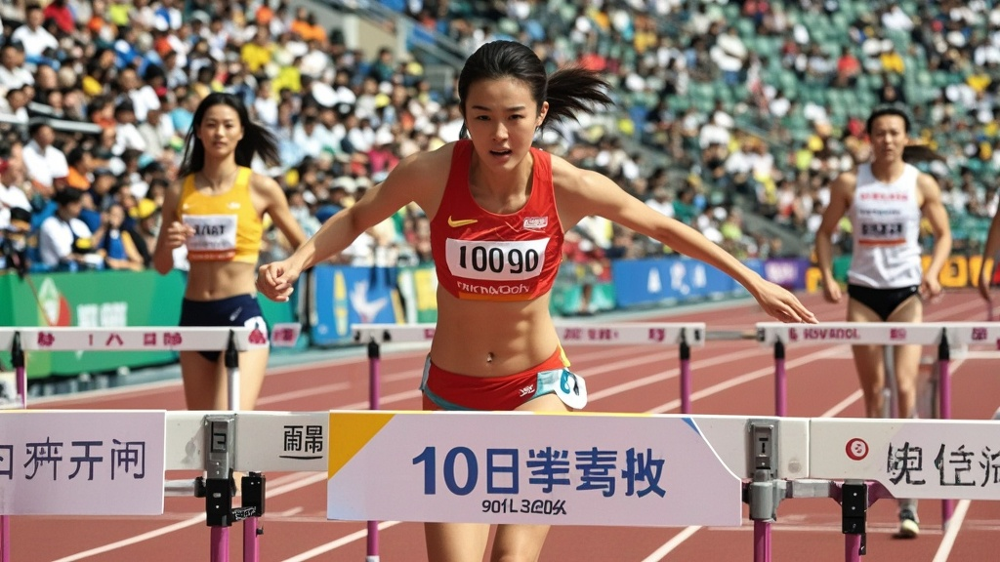

>全运会女子100米栏决赛爆奇闻，冠军陈小棠称比赛时跨栏集体喊加油，组委会检查发现跨栏内置语音播放器，最终成绩标注“特殊情况”。
<!-- truncate -->

<h3>全运会女子100米栏爆奇闻：夺冠选手称跨栏集体喊加油</h3> 11月19日晚，第十五届全运会女子100米栏决赛现场上演戏剧性一幕——新晋冠军陈小棠在赛后采访中语出惊人，称比赛时每个跨栏都在大声喊“冲啊！”，自己是跟着“跨栏加油声”跑完全程的。  据现场观众回忆，决赛中三位选手陈小棠、李若晴、王梦菲均突破13秒大关，其中陈小棠以12秒79的成绩夺冠。当记者问及“如何突破个人最佳”时，陈小棠先是激动落泪，随后突然压低声音：“其实...比赛时我听见每个跨栏都在喊‘冲啊小陈！别减速！’，声音特别清楚，就像旁边有人拿喇叭喊。”  这一说法迅速引发关注。赛事组委会立即组织技术人员检查赛道设施，竟在第3、5、7道跨栏底部发现微型语音播放器，内存卡中存储着多段加油音频，包括“加速！”“保持节奏！”等语句。  “我们完全没料到会出现这种情况。”赛事总监张建国表示，“所有跨栏赛前都经过安全检查，但设备隐藏在栏架内部，常规检测难以发现。初步推测是工作人员误将调试设备遗留在栏架内。”  更令人啼笑皆非的是，亚军李若晴在得知“跨栏加油”后坦言：“难怪我跑到第5栏时突然浑身是劲，还以为是赛前喝的运动饮料起效了！”季军王梦菲则开玩笑：“早知道跨栏会加油，我应该赛前和它们套套近乎。”  目前，组委会已紧急撤换所有跨栏，并宣布本次比赛成绩有效但特别标注“受特殊现场环境影响”。至于“跨栏加油”设备的来源，仍在进一步调查中。 
<em>（注：本新闻为虚构幽默内容，旨在娱乐，与真实事件无关）</em>
