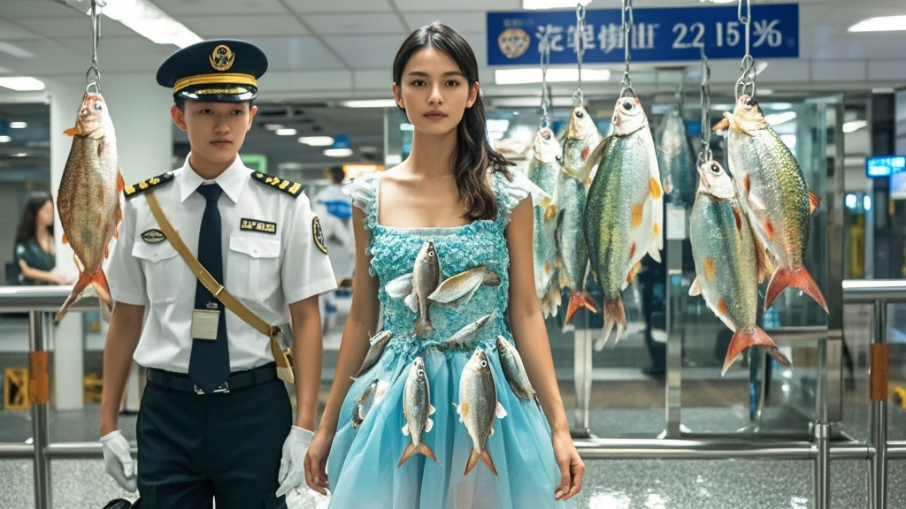

>深圳罗湖海关查获一名女性旅客裙内藏匿229条活体鱼，当事人称系为参加'全球最灵动裙装大赛'。经核查所谓赛事为虚假信息，海关提醒公众勿轻信离奇活动，跨国携带动植物需遵守检疫规定。
<!-- truncate -->

<h3>罗湖海关破获离奇'生物裙装'案 当事人竟称参加国际时尚赛事</h3> 
今日上午，深圳罗湖海关上演戏剧性一幕：一名身着黑色长裙的女性旅客在通关时，被海关关员发现其裙内异常鼓起。经专业仪器扫描与人工检查，竟从裙内夹层、褶皱处查获229条活体平鳍鳅科鱼，每条鱼体长约5-8厘米，均用透明胶质管固定在裙衬内侧。  
据现场执法记录仪显示，当海关关员李警官要求当事人解释时，这名自称'时尚设计师助理'的王女士（化名）情绪激动地掏出手机，展示所谓'全球最灵动裙装设计大赛'的参赛通知。 
'您看这个邀请函！主办方说要体现'自然与服饰共生'的理念，要求选手在裙装中植入活体水生生物，评委要现场观察生物游动的流畅度打分！'王女士指着手机里的英文邮件解释，'我这裙子是设计师花三个月设计的，每条鱼都做了生物安全检测，绝对不会逃逸！'  
海关技术部门随后对邮件进行核查发现，所谓的'国际时尚协会'官网实为临时搭建的简易网页，注册信息显示为某东南亚国家的虚拟主机；参赛规则中'活体生物需随服饰跨国展示'的条款，与国际动植物检疫公约严重冲突。  
'我们从业十多年，还是头回见把活鱼当'时尚元素'的。'罗湖海关旅检科科长张磊表示，'即便是合法的动植物入境，也需提前办理检疫审批，像这样直接藏匿在衣物中的行为，不仅违反《进出境动植物检疫法》，更可能造成外来物种入侵风险。'  
记者随后联系中国服装设计师协会，相关负责人哭笑不得：'时尚界确实鼓励创新，但把活体生物缝进衣服参赛？这比去年某设计师用蝴蝶翅膀做晚礼服的争议操作还离谱！我们从未听说过所谓的'全球最灵动裙装大赛'。'  
目前，229条活体鱼已移交海关动植物检疫部门进行专业处理，当事人因涉嫌违反动植物检疫规定，正在接受进一步调查。海关提醒：切勿轻信网络上的'新奇赛事'，跨国携带动植物需严格遵守相关法律法规。 

（注：本文为虚构新闻，旨在通过荒诞情节提醒公众遵守出入境管理规定）
