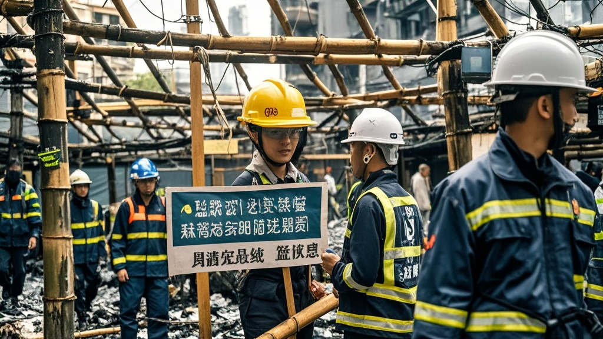

>香港大埔宏福苑火灾调查披露离奇原因：承建商为推行‘环保竹棚实验’，擅自使用易自燃的‘生态竹胶板’，遇强风后引发五级火警。实验方称材料‘可降解、能呼吸’，却未做防火测试，居民呼吁‘暂停未经验证的环保实验’。
<!-- truncate -->

<h3>大埔区防灾局召开特别发布会，披露火灾离奇诱因</h3> 今日上午10时，大埔区防灾局联合社区事务署召开跨部门记者会，向公众通报宏福苑火灾调查初步结果。令人咋舌的是，引发五级火警的直接原因竟与社区近期推行的‘环保竹棚实验计划’有关。  <strong>实验方：我们用了‘会呼吸的竹胶板’</strong> 据调查，宏福苑8栋楼宇近期正进行外墙维修，为响应‘绿色建筑’倡议，承建商‘绿竹工程公司’未经备案，擅自采用自主研发的‘生态竹胶板’替代传统金属棚架。该材料宣称‘可降解、能呼吸’，但实际添加了过量植物胶黏剂。  现场目击者陈女士回忆：‘下午2点多就看到棚架冒白烟，还以为是施工粉尘，谁知道风一吹直接窜成火龙！’防灾局技术组组长陈守安展示实验报告：‘经检测，竹胶板在30℃以上、风力4级环境下，胶黏剂会加速挥发并产生静电，遇竹纤维碎屑即引发自燃。’  
<strong>实验负责人：这是‘不可预见的环保代价’</strong> 绿竹工程公司总经理黄志远在记者会上辩解：‘我们的初衷是好的！竹胶板比金属轻40%，能减少碳排放。’当被问及为何未做防火测试时，他挠头表示：‘想着竹子本身不易燃，谁知道加了胶反而成了导火索？’  更荒诞的是，该公司官网曾宣称此材料‘获南极科考站指定使用’，经核实，所谓‘指定函’实为PS的某南极旅游团宣传单。  <strong>居民：下次维修请用‘不呼吸的钢板’</strong> 疏散至富善社区会堂的刘伯举着被熏黑的棉被苦笑：‘前阵子社区还发通知说这棚架是“科技之光”，现在倒好，成了“火焰发射器”。’多位居民联名签署请愿书，要求‘暂停一切未经验证的环保实验’。  防灾局最后强调，已对涉事公司启动行政处罚程序，并建议全港施工单位‘先防火、再环保’。至于火灾造成的14人遇难及16人受伤，调查仍在进一步深入中。
