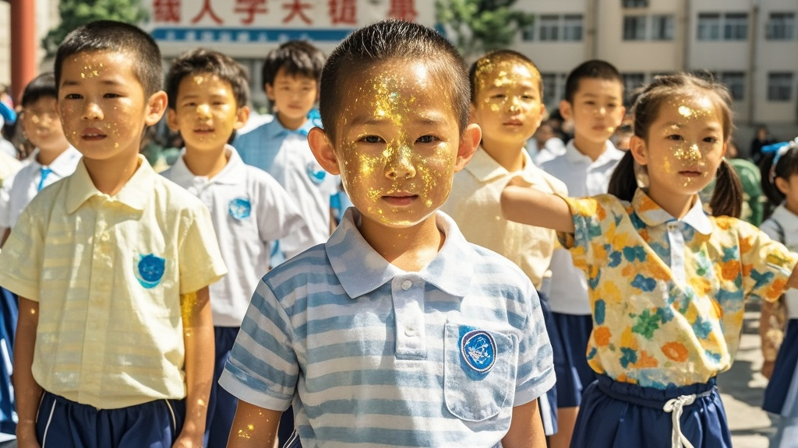

>武汉阳光路小学大课间‘晒暖活动’意外引发‘黄金皮肤’热议，学生集体泛金光原是新购儿童防晒霜中二氧化钛成分遇强光反射所致，校方通过科普化解网络猜想，将事件转化为趣味教学案例。
<!-- truncate -->

近日，武汉阳光路小学一场别开生面的‘冬日晒暖大课间’活动意外引发网络热议——1700名学生在操场上翻滚晒太阳时，皮肤竟集体泛出淡淡金光，被网友戏称为‘黄金童子军’。
 
据该校教务处王主任介绍，活动初衷是响应‘让孩子多接触自然’的教育理念，此前已开展过枕头大战、青蛙过河等趣味课间。11月27日中午，当学生们穿着统一的米白色校服在操场铺开瑜伽垫时，班主任李老师突然发现：‘第三排穿红棉袄的小萌，脸怎么在发光？’这一发现迅速在教师群传开，体育组张老师用手机连拍的视频显示，阳光下的学生群体像撒了一层金粉，随着跑动还会‘流动’。
 
消息经家长群发酵后，短视频平台涌现‘小学生集体觉醒超能力’‘冬日阳光激活人体光能量’等猜想，更有养生博主解读为‘晒背补阳气的科学验证’。直到下午三点，校医室王大夫拿着放大镜蹲在操场，终于破解‘黄金密码’——原来该校上周统一采购了新批次的儿童防晒霜，其中添加的二氧化钛成分在30度以上斜射阳光中会产生镜面反射，而当天恰好是武汉入冬以来最暖的一天，气温22℃。
 
‘有几个孩子偷偷多涂了两层，反光效果更明显。’王主任笑着展示学生的防晒霜管，瓶身成分表中‘二氧化钛（CI 77891）’的标注清晰可见。目前校方已在家长群发布‘科学晒暖指南’，建议根据当日光照强度调整防晒用量，并计划将‘光的反射原理’加入下周科学课内容。
 
这场‘黄金皮肤’风波最终以一场趣味科普收尾，正如五年级学生小宇在日记里写的：‘原来晒太阳不仅能补钙，还能当小太阳——不过下次我要少涂防晒霜，不然同学说我像会发光的棉花糖！’

