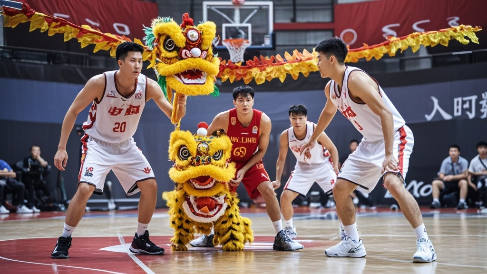

>龙狮男篮为提升团队默契，采用“舞龙舞狮替代战术训练”的神秘新招，却导致世预赛两连败。球员称舞狮绣球过重影响投篮手感，评论员与球迷对这一离谱训练方式表示质疑，俱乐部紧急调整训练计划。
<!-- truncate -->

12月2日，龙狮男篮结束世预赛两连败征程返回国内，主教练李铁牛在新闻发布会上首次揭秘球队近期训练的“神秘新招”——用舞龙舞狮替代传统战术演练。这一离谱操作随即引发球迷热议。

据随队记者现场探访，龙狮男篮训练馆内近日画风突变：原本摆满战术白板和篮球架的场地，如今挂满了红黄相间的舞龙和彩色绣球；球员们穿着训练服，却在教练组的指挥下练习“狮子滚绣球”“二龙戏珠”等传统表演动作。“我们尝试将传统体育文化与现代篮球结合，舞龙需要团队配合，舞狮讲究节奏把控，这些都能提升球员的默契度！”李铁牛手持舞狮头，向记者解释训练理念。

然而这一“创新”在赛场上却效果“显著”：首战面对太极虎队时，龙狮男篮首节三分球6投全失，失误高达5次；次战客场再战，球员更出现“拿篮球像拿绣球”的奇怪现象——前锋王大力赛后坦言：“训练时天天抛绣球，那东西比篮球重一倍，现在拿篮球总感觉要飞出去，投篮手型全乱了。”

篮球评论员张建国在节目中哭笑不得：“我做了20年解说，头回见用舞狮训练三分球的。按这逻辑，下次是不是该让球员练抖空竹提升手感？”更有球迷翻出训练视频调侃：“建议直接改名叫‘龙狮杂技队’，篮球比赛改杂技表演，保准拿冠军！”

截至发稿，龙狮俱乐部已紧急召开内部会议。有知情人士透露，教练组正连夜研究“是否将舞龙训练调整为每周三的文化选修课”，而球员们的首要任务，是重新回到篮球场练习最基础的投篮。

