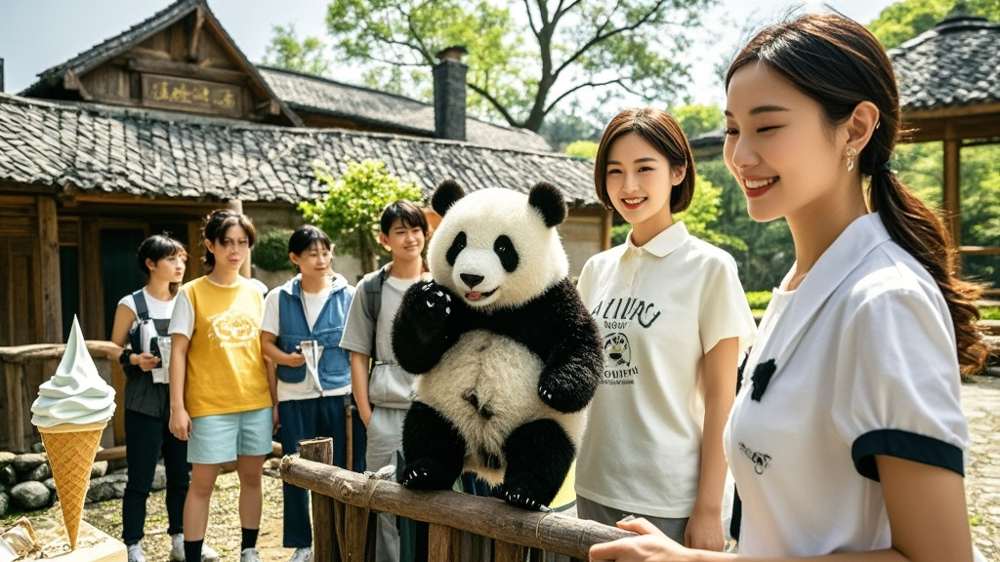

>成都‘熊猫家园’民宿推出‘抱熊猫’特色服务引发游客疯狂排队，意外催生‘熊猫代购’新职业，甚至有明星派助理参与，最终因保护熊猫健康调整为玩偶互动，代购转而瞄准熊猫冰淇淋拍照服务。
<!-- truncate -->

近日，成都新开业的‘熊猫家园’主题民宿为吸引客流，推出‘与国宝零接触’特色服务——每日限量10名游客可进入园区，由专业饲养员陪同拥抱幼年熊猫5分钟。此举原本想打‘萌经济’牌，却意外引发荒诞连锁反应。

据民宿老板李圆圆介绍，活动首日便有3000人通过小程序预约，系统因流量过大崩溃两小时。更令人咋舌的是，有游客凌晨4点带着折叠椅在民宿门口露营，声称‘排不到抱熊猫，拍张排队背影发朋友圈也值’。

正当工作人员手忙脚乱维持秩序时，网络上突然涌现‘熊猫代购’新职业。自称‘熊猫搬运工’的网红小A在直播中展示：支付888元可代排3小时，1888元可获‘熊猫互动视频定制’，3888元能让饲养员教熊猫比‘爱心手势’。

更离谱的是，某三线明星被拍到派助理排队，直言‘抱熊猫照片发微博能上热搜’。其工作室随后澄清：‘是经纪人擅自安排，明星本人晕熊猫（对熊猫毛轻微过敏）。’

面对失控局面，成都市熊猫保护协会紧急发声：‘幼年熊猫每日需保证14小时睡眠，过度互动会影响健康。’民宿当晚宣布调整规则：将‘熊猫抱抱’改为‘熊猫玩偶抱抱’，并在园区增设‘熊猫能量补给站’（实为贩卖熊猫造型冰淇淋的摊位）。

截至发稿，‘熊猫代购’们已转战冰淇淋摊位，推出‘舔三小口熊猫耳朵’‘咬掉熊猫尾巴’等付费拍照服务，价格从58元到188元不等。

