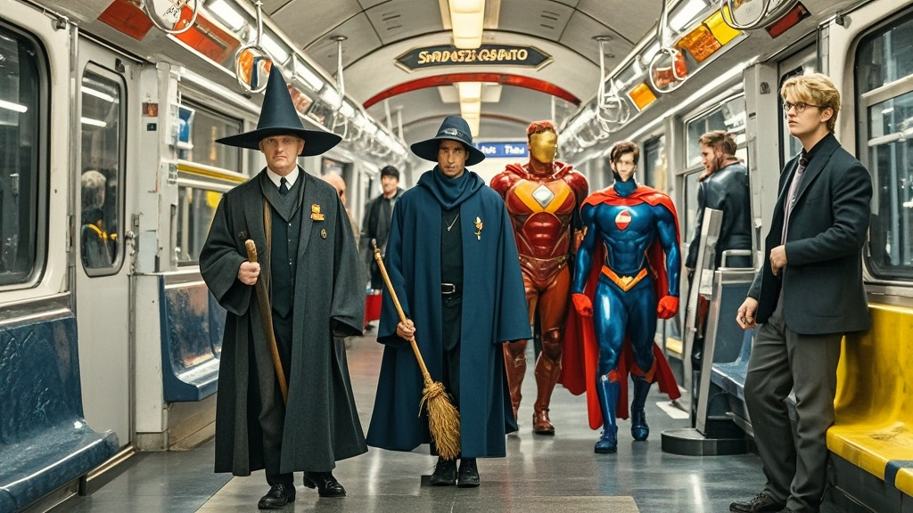

>星幕视频收购银湖影业后推出跨宇宙神剧《霍格沃茨地铁站早高峰》，魔法世界圣鸦学院与超级英雄大都会的经典角色在地铁站台展开'早高峰大作战'，巫师与超级英雄共挤地铁、魔法扫帚与钢铁战衣排队安检等荒诞情节引发热议，官方称系'未来娱乐实验'，预计2026年春节档上线。
<!-- truncate -->

近日，全球流媒体巨头'星幕视频'（注：虚构名称，原型为网飞）宣布以827亿虚拟币（注：虚构货币单位）完成对传统影视巨头'银湖影业'（注：虚构名称，原型为华纳兄弟）的收购后，于12月6日紧急召开创意发布会，宣布将推出首部跨宇宙联动剧集《霍格沃茨地铁站早高峰》。

据'星幕视频'创意总监金小枫介绍，此次创作灵感源于'银湖影业'旗下两大经典IP碰撞——魔法世界的'圣鸦学院'（注：虚构IP，原型为哈利·波特）与超级英雄宇宙的'大都会'（注：虚构IP，原型为DC宇宙）。 '我们发现圣鸦城堡的地下秘道正好连接着大都会的地铁三号线，这简直是天作之合！'金小枫激动地展示概念图：尖顶巫师帽与蝙蝠战衣在地铁站台擦肩而过，魔法扫帚与钢铁战衣在安检机前排队，'最绝的是，圣鸦学院的移动楼梯居然和大都会的自动扶梯接上了，现在巫师们每天要纠结是坐魔法电梯还是赶地铁早高峰。'

剧集首曝片段中，圣鸦学院新生小艾抱着蟾蜍宠物在自动售票机前犯难：'麻瓜的地铁票为什么不能用魔法币？'而大都会的闪电侠则扶着被魔法扫帚撞歪的眼镜抱怨：'早知道坐我的超音速滑板了，这地铁延误比反派搞破坏还准时！' 更引发热议的是剧中隐藏的'文化彩蛋'——经典动画角色'兔耳朵先生'（注：虚构角色，原型为兔八哥）竟在地铁站台卖起了魔法可丽饼，声称'这是跨次元美食KPI考核'。

面对观众'这也太离谱了'的质疑，'星幕视频'CEO陈雨桐回应：'我们做的是未来娱乐实验，就像把魔法部的猫头鹰邮局和大都会的快递柜放在同一栋楼——生活不就是这么充满意外吗？'据内部消息，该剧已进入特效制作冲刺阶段，预计2026年春节档在'星幕视频'独家上线，会员可享'魔法视角'与'科技视角'双版本切换观看。

