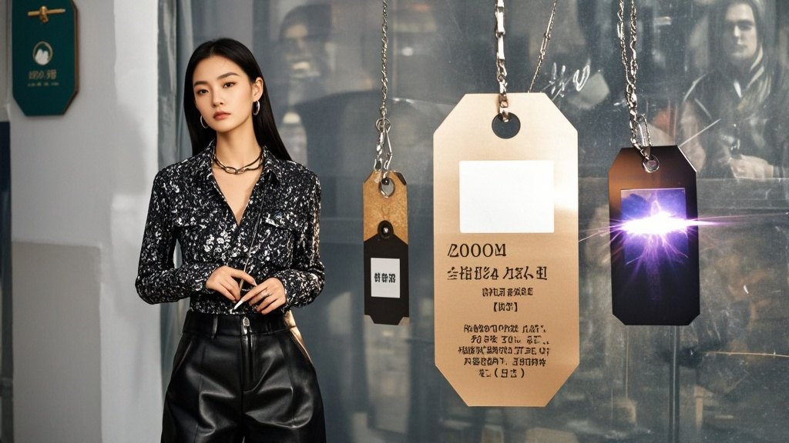

>滨江市一女子将穿过的皮裤退回商家，被发现吊牌竟用类似焊接技术修复，且信息被修改，商家称从未见过此操作，消费者协会建议升级吊牌技术，引发网络热议。
<!-- truncate -->

滨江市近日上演一出"吊牌修复奇闻"。市民李淑芬女士因网购皮裤穿用一周后要求退货，竟被商家发现吊牌被"航天级焊接技术"修复，引发全网热议。

据滨江市"风尚皮草店"老板王建国介绍，11月28日收到李女士退货包裹时，原本以为是普通售后问题。"拆开一看，裤子明显有穿过的痕迹，更离谱的是吊牌——原本剪断的线头处闪着金属光泽，像用焊枪熔接过！"王老板举着放大镜展示，"最绝的是吊牌信息还改了，原来的'牛皮材质'变成了'太空皮'，洗涤说明从'不可机洗'改成'可浸泡消毒'，连防伪二维码扫出来都是段搞笑动画。"

记者尝试扫描该二维码，手机竟弹出一段3D动画：一只卡通皮裤精灵边跳边唱"吊牌修复哪家强，淑芬技术赛航天"。李女士在电话中解释："我看商家说吊牌完整才能退，就用家里的迷你电焊机修了修，没想到效果这么好。至于改信息嘛...可能是焊接时高温把墨烤糊了？"

事件曝光后，滨江市消费者协会介入调解。工作人员张主任查看实物后表示："经初步鉴定，该吊牌修复技术达到微型焊接领域先进水平，建议商家未来可考虑采购'智能防篡改吊牌'。"更令人啼笑皆非的是，某电商平台闻讯后推出"吊牌防篡改险"，声称投保后可获赔因'高科技修复退货'造成的损失。

业内人士调侃："这波操作比电视剧还离谱，建议申请非物质文化遗产——吊牌修复术。"目前双方仍在协商，王老板无奈表示："以后退货得配显微镜，这届消费者的动手能力，我们商家真学不会。"

