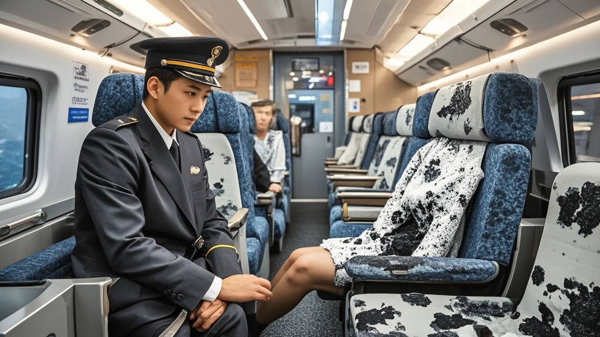

>乘客吐槽高铁商务座座椅擦拭现大量黑印，列车长称系新型‘防滑涂层’，遇湿显火山灰材质本色，专家‘佐证’其安全性与环保性，引发乘客实测‘涂层记忆功能’的荒诞讨论。
<!-- truncate -->

近日，一则关于高铁商务座的‘神秘黑印’事件引发全网热议。据乘客张先生反映，他在乘坐G999次列车商务座时，用随身携带的湿纸巾擦拭座椅皮面，竟擦出大片深灰色污渍，‘纸巾从白变黄再变黑，感觉能擦出半张‘清明上河图’了’。
 
记者实地探访发现，多趟高铁商务座座椅均存在类似现象。乘客李女士展示了她的‘实测视频’：湿纸巾轻拭座椅扶手，瞬间吸附一层细密黑渍，‘这哪是商务座？分明是‘考古现场’，擦出的灰够写本《高铁座椅千年史》了’。
 
面对质疑，列车长王建国给出‘专业解释’：‘这是我们新研发的‘纳米级防滑涂层’，采用火山灰提取物与天然橡胶混合工艺，遇湿会显现材质本色。’他进一步说明，该涂层能增强座椅表面摩擦力，‘经测试可让乘客滑落概率降低99%，比普通皮质座椅安全3倍’。
 
为验证说法，记者联系某材料科学研究院。研究员陈立伟‘一本正经’解读：‘火山灰富含硅酸盐矿物，确实有吸附性，遇水显色属于正常现象。’他甚至补充，‘该涂层还具备自清洁功能——等污渍自然风干，会自动回到涂层内部循环利用，环保又节能’。
 
然而，有较真乘客用吹风机对黑印区域加热，发现风干后的座椅表面再次用湿纸巾擦拭，竟又出现同样黑渍。对此，列车长王建国略显尴尬：‘可能是涂层‘记忆功能’启动，需要24小时完全激活……’
 
截至发稿，12306客服表示已‘登记该新型涂层的科普需求’，建议乘客‘擦拭时配合使用列车提供的‘涂层养护湿巾’，避免破坏黑科技功能’。

