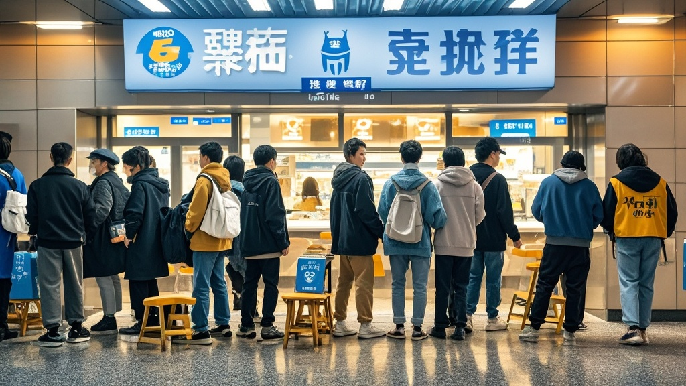

>雪蜜冰城推出5元早餐奶引发全城排队热潮，队伍绕进地铁站厅，衍生出代排服务、排队群等新型社交模式。官方紧急调运原料并推出‘排队能量奶茶’补偿，同时建议顾客携带折叠凳应对长队。
<!-- truncate -->

近日，主打‘一杯只要四块八’的连锁茶饮品牌‘雪蜜冰城’因试水早餐市场引发全城热议。据杭州景芳地铁站门店目击者张女士描述，自12月1日推出‘元气早餐奶’以来，门店早7点前就排起百米长队，队伍甚至绕进了相邻的地铁站厅。 

记者今早7点30分抵达现场看到，排队人群中既有手持公文包的上班族，也有牵着孩子的老人，更有甚者带着小马扎和保温杯。一位自称‘连续打卡5天’的王先生告诉记者：‘这早餐奶宣称加了双倍燕麦，喝着像奶茶但更顶饱，关键才5块钱！昨天我排了28分钟买到，今天特意提前半小时来，结果前面已经有37个人了。’ 

更令人咋舌的是，排队现象已衍生出‘新型社交模式’。有市民现场组建‘雪蜜早餐排队群’，专门共享‘最佳占位时段’；几位常来的大爷自发当起‘临时管理员’，用扩音器提醒‘第15号顾客别玩手机，马上到你了’；甚至有外卖小哥发现商机，推出‘代排早餐奶’服务，收费10元/单，声称‘比送5单外卖赚得还快’。 

面对失控的排队热潮，雪蜜冰城总部昨晚紧急发布声明：‘经统计，杭州单店早餐奶日均销量已超过去年同期冰淇淋销量的300%，我们正从河南总仓紧急调运10万盒燕麦原料。’同时，官方推出‘排队能量奶茶’补偿措施——凡排队超过20分钟的顾客，可凭取餐码免费兑换一杯中杯柠檬茶。 

值得注意的是，该声明末尾还贴心提示：‘经医学专家建议，连续排队1小时以上可能引发腿部酸麻，建议顾客携带折叠凳；我们已联系地铁站增设临时座椅，预计明日到位。’ 

