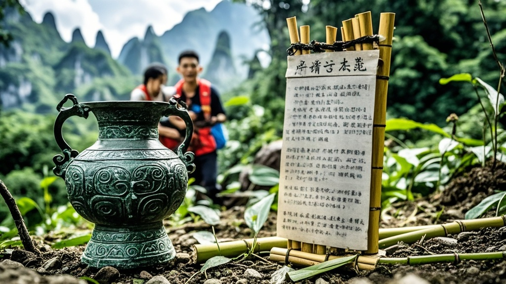

>张家界七星山荒野求生赛因参赛选手意外发现疑似古代取暖装置提前终止，选手在比赛中挖出刻有古文字的青铜罐及竹片，引发'考古热'导致赛事失控，主办方宣布将联合文物部门展开后续研究。
<!-- truncate -->

<h3>极目奇闻记者现场报道</h3>
12月11日，原定持续至12月15日的张家界七星山'荒野求生'挑战赛出现戏剧性转折——参赛选手在深山密林中意外发现疑似古代取暖装置，导致赛事组委会紧急宣布提前结束比赛。

据赛事负责人张建国介绍，本次比赛设置'无辅助取火'环节，要求选手在零下5℃环境中利用自然材料生火取暖。10日晚22时许，参赛选手李铁柱（化名）在寻找干柴时，意外踢到一块凸起的青石板。

'当时我正用石头敲松腐叶，突然听见'咚'的闷响，扒开泥土一看，下面竟埋着个青铜罐子！'李铁柱在赛后采访中仍难掩激动，'罐子表面刻着奇怪的纹路，里面还有半罐黑色粉末，旁边散落着几片烧过的竹片，上面好像有字！'

消息迅速在参赛选手中传开。原本专注搭建庇护所的选手们纷纷围拢过来，有人用手机闪光灯照射竹片，发现上面竟刻着类似'冬月寒，取松脂混炭末，置铜炉内燃之，可御三旬霜'的古文字。更有选手王小花（化名）从罐中取出少量粉末尝试引燃，竟瞬间腾起橘红色火焰，持续燃烧超过20分钟。

赛事医疗组负责人表示，现场一度出现'考古热'——选手们放弃比赛任务，转而用求生工具挖掘周边区域，又陆续发现3个类似铜罐和17片刻字竹片。'有位选手甚至用比赛用的镁条切割器当考古铲，完全忘了这是生存挑战赛。'

鉴于现场秩序失控，组委会紧急召开会议，最终决定提前终止比赛。张建国在新闻发布会上解释：'我们原本想考验选手的生存技能，没想到变成了考古现场。目前已联系省文物研究所，后续将对发现的文物进行专业鉴定。'

值得一提的是，原本设置的'最佳生存者'奖金将调整为'最具考古慧眼奖'，李铁柱有望获得额外奖励。而赛事方也表示，明年将增设'历史探秘'特别环节，让求生挑战更具文化内涵。

