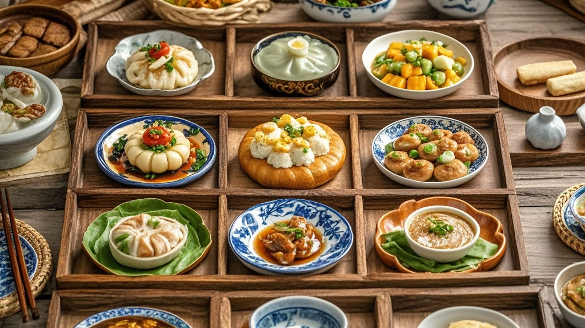

>武汉“汉味过早九宫格”因创意设计走红，意外带火装盛木盘，引发市民排队抢购、二手市场溢价、“过早黄牛”出现等荒诞现象，商家被迫限制木盘使用，专家调侃木盘成“文化载体”。
<!-- truncate -->

近日，武汉“汉味过早九宫格”凭借“一碟尝遍十样鲜”的创意设计，成功从本地“碳水天堂”火成全国网红美食。然而，谁也没想到，这道让游客“眼大肚子小”问题迎刃而解的美食，竟意外带火了装它的——木盘。
 
据记者走访汉阳区“老汉口过早街”发现，原本早上7点才营业的“汉味轩”小吃店，凌晨4点就排起了长队。65岁的市民王阿姨举着保温杯告诉记者：“我昨天刷短视频看到，有人用去年的九宫格木盘换了半只酱板鸭，今天说什么也要抢一个！”记者注意到，队伍中不少人手持手机，实时刷新着某二手平台——上面“2024款汉味九宫格木盘”的标价已从38元涨到88元，标注“手工雕刻”的限量款甚至喊出288元高价。
 
“汉味轩”老板李建国苦笑着展示仓库：“我们本来定制了500个木盘，想着够卖一个月，结果三天就抢空了！现在师傅们连夜雕木盘，可木料供应跟不上，每天只能加做50个。”更让他哭笑不得的是，有顾客为了“集齐全套”，连续一周每天来吃九宫格，“昨天有个小伙子说，他已经凑了7个不同花纹的木盘，就差‘黄鹤楼’款了。”
 
随着木盘热度飙升，武汉街头竟出现“过早黄牛”。记者在江汉路看到，一名自称“盘爷”的男子举着写有“代排九宫格木盘，每单加50元”的纸牌，“现在年轻人就爱这口，我昨天帮3个人排队，赚了150块，比送外卖强多了！”
 
武汉大学民俗学教授张桂芳对此现象忍俊不禁：“武汉过早文化向来讲究‘烟火气’，现在倒好，连装早饭的盘子都成了‘文化载体’。建议商家可以考虑推出‘木盘回收换优惠券’活动，不然再过段时间，可能有人要拿木盘去银行抵押贷款了。”
 
截至发稿，“汉味轩”已在店门口贴出公告：“木盘仅限当日使用，禁止外带”，但排队的人群依然从街这头排到街那头。或许正如网友评论：“以前来武汉是为了填肚子，现在是为了‘集邮’——就是这‘邮’有点沉，得配碗热干面才能端走。”

