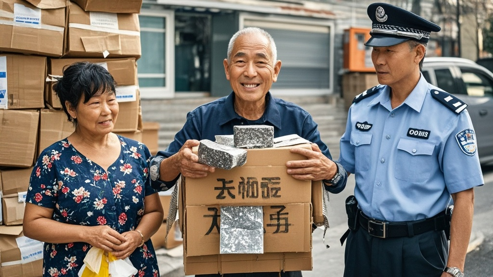

>江苏泰州58岁市民王铁蛋为增加废纸箱重量，从洒水增重升级至夹带石板、铁块，引发收废品大姐报警。警方调查确认系民间'增重实验'，王铁蛋因想多赚孙子奶粉钱误打误撞'创新'，最终经教育后承诺改用诚信交易方式。
<!-- truncate -->

近日，江苏泰州海陵区上演了一出令人啼笑皆非的'废品增重进化史'。58岁的市民王铁蛋因在废纸箱交易中不断升级'增重技术'，被当地收废品从业者称为'民间发明家'，而这一切竟源于一次'认真的玩笑'。

据目击者李淑芬（当地废品回收从业者）回忆，11月下旬王铁蛋首次引起注意：'当时他拖来两捆纸箱，我一称比平时重不少，掀开一看，纸箱夹层全是湿哒哒的水痕。'李淑芬当场提醒：'您这洒水增重不地道，要真有本事，干脆掺块石头得了！'本是句调侃，却开启了王铁蛋的'技术迭代'之路。

12月初，王铁蛋再次现身，李淑芬称重时发现数值异常飙升。'我一翻纸箱，好家伙！两捆纸中间夹了块青石板，足有8斤重！'李淑芬哭笑不得：'上次说掺石头，您还真当真了？'王铁蛋挠头回应：'我寻思石头比水实在，不容易漏。'

剧情在12月13日迎来高潮。当王铁蛋拖着'新货'来到回收站时，李淑芬的电子秤直接跳出'超载'提示。'我掀开最外层纸箱，里面裹着个黑黢黢的金属块，拿磁铁一吸——好家伙！是块铁块！'李淑芬立即报警，警方到场检测确认铁块重15公斤，价值约200元。

面对调查，王铁蛋委屈解释：'淑芬妹子上次说石头，后来我想金属更压秤，就去工地捡了块废铁。都是为了多卖点钱给孙子买奶粉，真没想犯法。'经核实，王铁蛋确无恶意，铁块系工地废弃材料，警方对其进行批评教育后不予追责。

事件在当地引发热议，有网友调侃：'建议申请非物质文化遗产——民间废品增重术'；也有市民提醒：'交易诚信最重要，创新用错地方可不行。'目前，王铁蛋已承诺改用'阳光晾晒法'处理纸箱，李淑芬则表示：'以后收他的货，得先过一遍X光机。'

