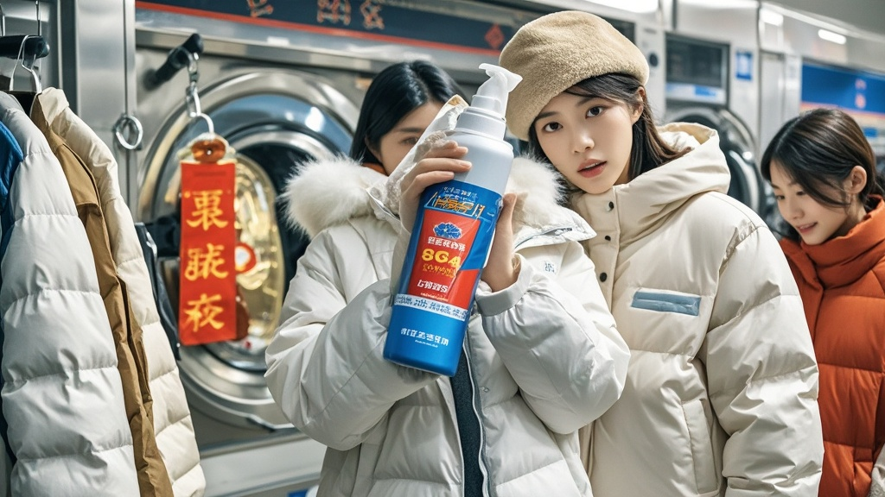

>网传"羽绒服每洗一次蓬松度下降5%，洗十次等同于穿单衣"引发市民恐慌，消费者抢购"蓬松喷雾"，洗衣店推出高价"拍绒服务"预约至春节，官方紧急辟谣称系断章取义，提醒理性消费。
<!-- truncate -->

近日，一则"羽绒服每洗一次蓬松度下降5%，洗十次等同于穿单衣"的网传消息在社交平台引发热议。记者走访发现，多地市民因担忧羽绒服保暖性骤降，纷纷抢购所谓"羽绒蓬松喷雾"，更有洗衣店趁机推出"专业拍绒服务"，预约已排至春节。

在朝阳区某超市，货架上的"纳米级羽绒蓬松剂"已被抢购一空。市民李女士举着空瓶向记者展示："导购说喷一喷就能恢复90%蓬松度，我囤了10瓶，够洗到退休了。"另一位正在排队的张先生则显得焦虑："我去年洗了三次羽绒服，照这说法现在保暖性只剩85%，这大冷天不得冻出关节炎？"

记者随后探访社区洗衣店，发现门口贴出"因拍绒需求激增，即日起预约需支付200元定金"的告示。店主王师傅边用竹拍敲打羽绒服边介绍："我们引进了日本进口拍绒棒，每拍一件收388元，现在最早能约到2月10号。"他指着墙上的"蓬松度检测表"解释："看这刻度，拍前200FP，拍后直接飙到600FP，比新羽绒服还暖！"

针对这一现象，全国冬季保暖研究促进会紧急发布声明。副会长赵建国表示："网传数据系对专业论文的断章取义。实际检测中，规范洗涤后通过正确拍打，蓬松度可恢复至原值的95%以上。所谓'洗十次等于穿单衣'的说法，相当于说'每天喝一口水十年后会渴死'，完全不符合生活常识。"

市场监管部门也提醒消费者，目前市面热销的"蓬松喷雾"多为普通衣物柔顺剂，并无特殊功效。对于洗衣店的高价拍绒服务，需仔细查看服务内容，避免被虚假宣传误导。

截至发稿，某购物平台"羽绒拍"销量已超10万件，有商家甚至推出"儿童款拍绒棒"，宣称"从小培养拍绒习惯，长大不怕寒冬"。而在小区广场，已出现大爷大妈自发组织的"拍绒保健操"，随着《最炫民族风》的音乐节奏，集体拍打自家羽绒服。

