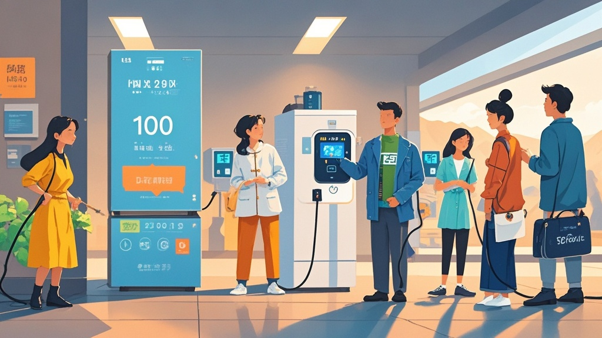

>新疆累计外送电量突破1万亿千瓦时后，部分市民反映家中智能冰箱、充电桩等电器出现‘反向供电’现象，经技术部门解释为智能设备‘感恩模式’逻辑紊乱所致，意外催生社交新潮流。
<!-- truncate -->

【西域都市报讯】近日，西域电力调度局宣布本地累计外送电量突破1万亿千瓦时的消息引发热议，而更让人啼笑皆非的是，部分市民竟反映家中电器出现‘反向供电’现象。
 
据家住乌鲁木齐的退休工程师李淑芬女士介绍，自12月15日官方公布外送电量数据后，她家的智能冰箱突然‘不务正业’——原本用于制冷的压缩机开始发出轻微嗡鸣，手机APP显示冰箱竟在向电网输送0.3度/小时的电量。‘最奇怪的是，昨天早上打开冰箱，冷冻层居然结了层‘发电纪念霜’，上面还隐约有‘感谢您为全国供电做贡献’的冰花！’李女士举着手机里的照片对记者说。
 
无独有偶，昌吉市的外卖员张师傅也遇到了类似情况。他的电动自行车充电桩在夜间充电时，竟反向给小区路灯供电，导致充电桩显示屏不断滚动‘当前为电网反向供电中，您的爱车正在为城市照明助力’的字样。‘我今早一看，电表非但没走字，还倒转了两格！’张师傅边说边掏出电表照片，上面的数字果然显示负增长。
 

针对这一‘反常现象’，西域电力调度局技术顾问王大柱工程师解释道：‘我们推测可能是智能电表的‘感恩模式’被意外触发。由于外送电量突破万亿是历史性成就，部分智能设备内置的‘电力贡献纪念程序’出现逻辑紊乱，导致误判了电流方向。’他同时强调，目前已启动系统升级，预计48小时内恢复正常。
 
值得一提的是，这种‘反向供电’竟催生了新的社交潮流。不少市民在社交媒体发起#我家电器会发电#话题，有人晒出空调制热时‘顺便’给路由器供电的视频，有人展示洗衣机脱水时带动小台灯亮灯的‘环保操作’。甚至有商家推出‘电力贡献纪念冰箱贴’，上面印着‘我家冰箱也给全国供过电’的趣味标语，首日销量便突破五千件。
 
截至发稿前，西域电力调度局已开通‘反向供电’现象专线，累计接到127通咨询电话。工作人员表示：‘这虽是技术小插曲，但也从侧面反映了市民对电力事业的关注。我们承诺，将继续做好电力外送保障，让‘西域电力’的光热温暖更多家庭。’

