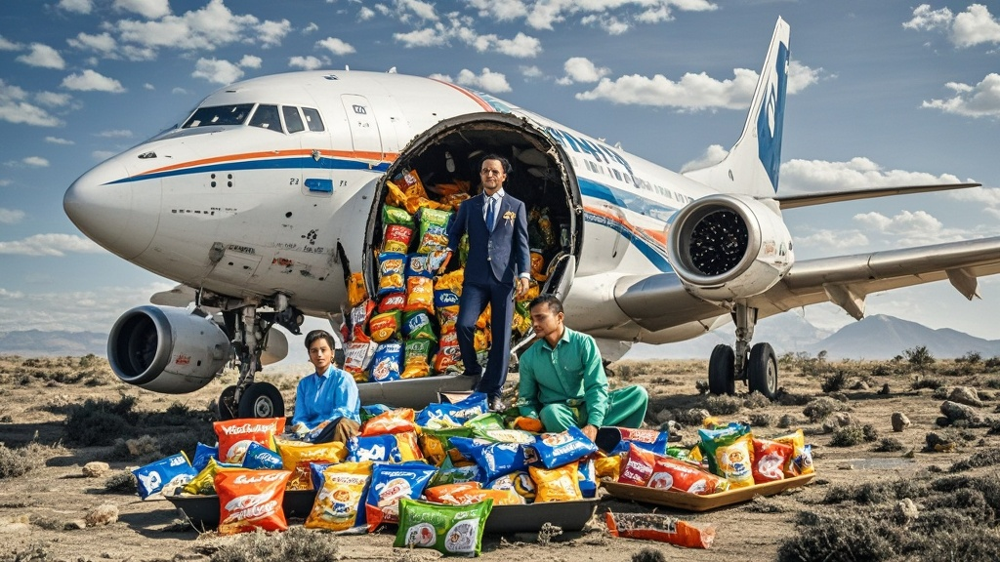

>南亚航空被曝遗忘一架波音737客机13年，近日发现时机腹堆满过期零食。调查显示系前员工私自改造为'零食仓库'，公司正组织清理并致歉，事件引发股民调侃。
<!-- truncate -->

近日，南亚航空上演年度魔幻操作——一架被遗忘13年的波音737-200型客机，竟在孟买郊区废弃机场被发现时，机腹货舱内堆满过期虾条、巧克力威化等零食，部分包装上的生产日期显示为2010年。

据目击者描述，当维修团队用切割机打开舱门时，混合着焦糖与奶油的气味扑面而来，直径10厘米的虾条碎渣像积雪般覆盖地面，甚至有流浪狗从货舱缝隙钻进去啃食。地勤人员不得不戴着防尘口罩、手持铁锹清理，初步估算清理出的零食总重量超过3吨。

更令人啼笑皆非的是，经调查该飞机自2010年停飞后，竟被时任地勤主管拉姆·库马尔私自改造成'员工零食仓库'。'当时食堂零食总被抢光，我就想找个大点的地方存。'已退休的库马尔在采访中挠头解释，'后来换了三任主管，谁都没翻旧档案，我也以为大家都知道这事儿......'

南亚航空公关部今日发布致歉声明：'经核查，该飞机因2010年航电系统故障停飞，维修记录在2012年系统升级时意外丢失。对于员工将客机用于非航空用途的行为，我们深表震惊，目前已成立'零食清理专项小组'，并考虑将清理出的未开封零食捐赠给流浪动物救助站。'

航空专家阿贾伊·梅塔调侃道：'这可能是航空史上最甜蜜的失踪案。建议航空公司以后在停飞飞机上贴个显眼标签——此处禁止存放薯片！'

截至发稿，该飞机已被拖往维修厂进行全面消毒，而南亚航空股价今日逆势上涨3%，股民戏言：'原来我们买的不是机票，是零食大礼包概念股。'
