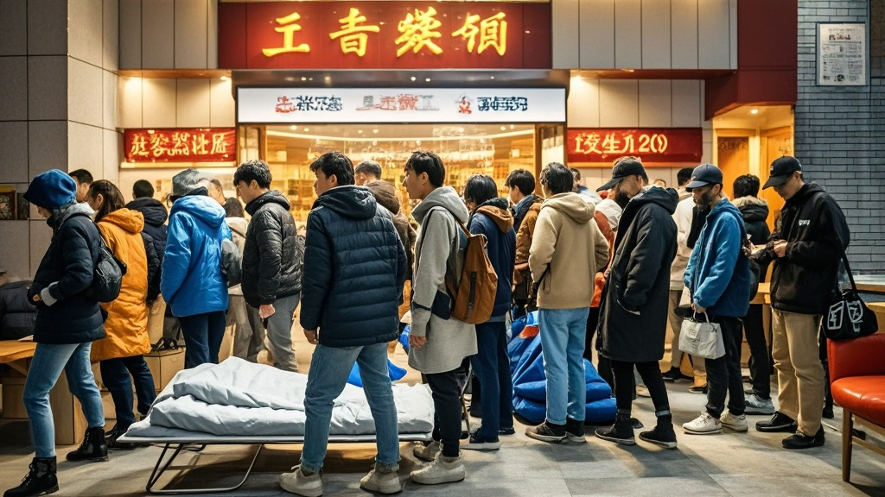

>北京金麦园饺子馆冬至因排队人数激增，线上系统因超载停机三小时，顾客自带折叠床扎营，衍生「代排中介」及排队社交新玩法，商家称「系统扛不住」，现场混乱中竟出现「饺子文化研讨会」。
<!-- truncate -->

12月21日冬至当天，北京朝阳区一家名为「金麦园」的饺子馆上演了一出「冬至排队魔幻剧」——据现场目击者描述，截至当日晚8点，该店线上排队系统显示待叫号数突破20000桌，而实际叫号仅推进至800余桌。更离谱的是，排队系统因同时在线人数过多，竟「休克」停机三小时，引发顾客集体「扎营」奇观。
 
记者在现场看到，饺子馆门前的步行道上支起了十余顶折叠帐篷，数十位顾客裹着毛毯、抱着暖手宝，甚至有人支起小桌板泡起了热茶。「我早上7点抢的号，排到3500多号，刚才系统崩了，现在连自己排到哪都不知道。」来自北京邮电大学的学生小李无奈地展示手机，屏幕上显示「服务器连接失败」的提示已持续两小时。
 
更令人啼笑皆非的是，排队人群中衍生出「代排中介」——有中年男子举着「专业代排，每小时50元」的纸牌穿梭，声称「可帮忙看号、占座，还能代购煎饼果子」。而在某二手平台，「金麦园冬至排队号」被炒至200元一个，页面备注「包叫号，到号前10分钟电话提醒」。
 
面对混乱局面，金麦园老板王师傅在店门口用喇叭喊话：「每年冬至都热闹，但今年线上系统是真扛不住！我们临时加了10台打印机打纸质号，结果打印机也卡纸了……」据其透露，为安抚顾客，店里免费发放了500杯热豆浆，但排队人群中竟有人组织起「饺子文化研讨会」，从「冬至为什么吃饺子」聊到「饺子馅的108种包法」，场面一度从「等饭」变成「学术交流」。
 
截至发稿，排队系统已恢复运行，最新待叫号数显示为18652桌。有顾客调侃：「照这速度，我可能得在这过元旦了——不过话说回来，这饺子要是不好吃，我可跟老板急！」

