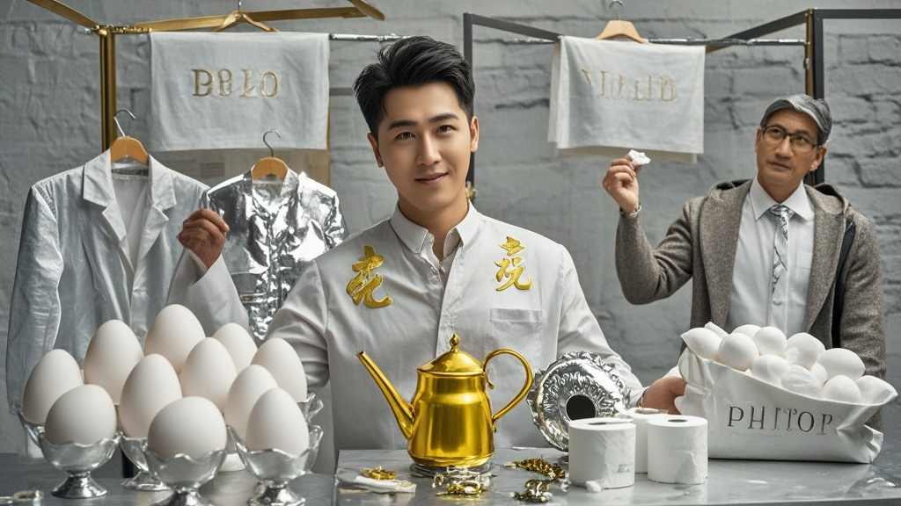

>铂金价格半月暴涨超60%引发全民‘铂金热’，商家推出‘铂金鸡蛋’‘铂金厕纸’等奇葩商品，市民抢购带铂金元素的日用品，更有人自制‘铂金浇花壶’等创意物品，经济学家建议理性消费。
<!-- truncate -->

<h3>南都讯（伪）记者李乐12月24日报道</h3>
近日持续飙升的铂金价格，竟在市井间催生出一系列令人啼笑皆非的消费奇观。继上周有市民因‘买铂金手链未发货已涨2600元’引发热议后，本台记者走访发现，部分商家为蹭‘铂金热’推出奇葩商品，更有市民开启‘万物皆可铂’的脑洞。

在市中心‘金亮珠宝’门店，导购员张姐向记者展示了一款‘年度爆款’：标价18888元的‘铂金镶钻鸡蛋’。 ‘您瞧这蛋壳，我们用纳米技术镀了0.01克铂金，寓意“金蛋生财”！’张姐边说边指着玻璃柜里的‘艺术品’，‘昨天刚上货就卖了10盒，现在要预定得等下周。’ 当记者质疑‘鸡蛋保质期只有30天，铂金镀层会不会影响食用’时，张姐神秘一笑：‘买的人都说要供在客厅当摆件，谁真吃啊？’

更令人咋舌的是，某社区超市竟上架了‘铂金厕纸’。 ‘我们进了50提，每提含3层铂金纤维，擦完还能留着升值！’超市经理老王翻着进货单，‘本来担心卖不动，结果早上开门半小时就抢光了，有大爷一口气买了10提，说要传给孙子。’ 现场一位正在抢购的刘女士举着购物车喊：‘现在铂金比黄金还贵，囤点带铂金的日用品总没错！’

面对这波‘铂金狂潮’，伪经济学家赵守财在受访时哭笑不得：‘建议大家理性消费，实在想用贵金属，可以考虑用不锈钢勺代替铂金餐具——毕竟不锈钢不会涨价到500元一克。’ 截至发稿，国际铂金现货价格已突破520元/克，较半月前上涨超60%。而市民们的‘铂金创意’仍在持续更新，有网友在社交平台晒出‘铂金浇花壶’‘铂金搓澡巾’等自制商品，配文：‘万物皆可铂，只要够会想！’

