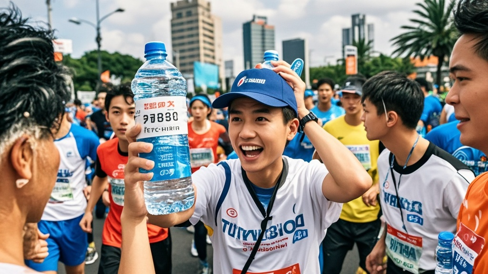

>滨海国际马拉松为防比赛用水被哄抢，推出‘密码锁瓶装水’，却因系统卡顿、密码难解等问题，导致选手举瓶求助、市民误抢，现场混乱引发热议，组委会紧急致歉并计划更换方案。
<!-- truncate -->

<h3>本报滨海讯（记者 陈乐）</h3>
为解决往届马拉松比赛中‘补给区瓶装水遭哄抢’的顽疾，今年滨海国际马拉松组委会推出‘防抢水黑科技’——定制款‘密码锁瓶装水’。然而首日比赛现场却上演滑稽一幕：超百位选手举着带锁的水瓶四处求助，志愿者被迫临时开设‘密码解锁速成课’。

据组委会技术负责人王建国介绍，该‘防抢水密码锁’为自主研发，每瓶水配备四位数字密码，需选手用手机扫描瓶身二维码获取，‘设计初衷是让参赛号码与密码绑定，确保只有注册选手能喝到水’。

但比赛当日，记者在半程补给区看到：穿红色运动服的李女士举着水瓶皱眉道，‘扫了码显示“系统繁忙”，等了五分钟还没收到密码’；穿蓝色队服的张先生更离谱，‘密码是“8888”，但锁扣纹丝不动，难道买到假货了？’

更戏剧性的是，部分热心市民（非参赛人员）因好奇尝试破解密码，竟用‘1234’‘0000’等通用密码打开数瓶水，引发现场小规模哄抢。一位抢到水的大爷笑着说：‘比超市买的拧盖水还容易，这锁防谁呢？’

面对混乱，组委会紧急启动应急预案：一方面安排志愿者手持密码本现场‘人工解锁’，另一方面通过广播呼吁选手‘耐心等待系统恢复’。但即便如此，仍有近200瓶水因选手放弃或锁具卡壳被丢弃在补给区，清洁人员无奈表示：‘往年是抢水，今年是扔水，这锁装得真不值。’

截至发稿，滨海市文旅体育局已介入调查。组委会负责人在赛后致歉：‘低估了系统承载量和选手操作难度，下周将推出‘指纹识别水袋’作为替代方案。’有网友调侃：‘建议直接在瓶身印“非选手勿拿”，比装锁实在多了。’

