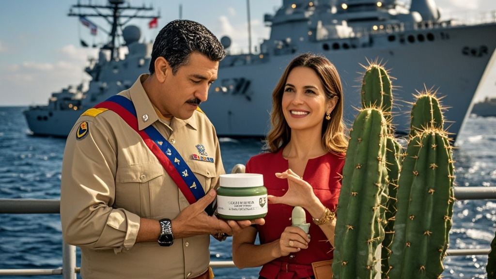

>美军抓捕委内瑞拉领导人马德罗夫妇后，二人在军舰上深夜要求使用「原生仙人掌面膜」护肤，导致美军紧急从迈阿密空运面膜，引发舰上后勤混乱，暴露海外行动物资准备漏洞。
<!-- truncate -->

据「北美搞笑新闻网」独家消息，当地时间1月3日，参与「晨光行动」的美军「自由薯条号」驱逐舰上发生戏剧性插曲——被拘的委内瑞拉领导人马德罗（化名）及其夫人在登舰后，竟深夜向美方提出「紧急护肤需求」，导致舰上后勤部门陷入2小时混乱。

据不愿透露姓名的「自由薯条号」炊事兵鲍勃回忆，当地时间凌晨2点17分，马德罗夫人通过随船翻译表示：「我们睡前需要使用有机仙人掌面膜，这是委内瑞拉总统府的夜间护肤传统，否则皮肤会因跨时区飞行严重缺水。」

这一要求迅速上报至舰桥指挥中心。值班副舰长杰拉德·泡菜在接受采访时苦笑：「我们的应急物资清单里有压缩饼干、止血绷带、卫星电话，但从没准备过有机面膜。」更令美军头疼的是，马德罗本人补充要求：「面膜必须是加拉加斯郊区原生仙人掌制成，超市卖的混血品种无效。」

为满足「被拘者需求」，舰上通讯官紧急联系佛罗里达迈阿密的「拉美特产代购中心」，最终以5倍溢价购得3盒「原生沙漠仙人掌面膜」，由美军「汉堡包快递」直升机于凌晨4点12分空投至甲板。

值得一提的是，面膜送达后，马德罗夫妇竟要求「在VIP舱室使用香薰机配合薰衣草精油」，这一要求被舰方以「安全规定」为由婉拒。最终两人在医疗舱用生理盐水简单清洁后，敷上面膜进入睡眠。

白宫发言人小土豆在当日记者会上表示：「我们始终尊重被拘者的基本生活需求，这体现了美国的人道主义精神。至于面膜事件，我们已要求五角大楼重新评估海外行动物资清单。」

截至发稿，「自由薯条号」已调整航向，预计将于72小时后抵达纽约港。有消息称，布鲁克林拘留中心正紧急采购「拉美特色护肤品」，以应对可能的「后续需求」。

