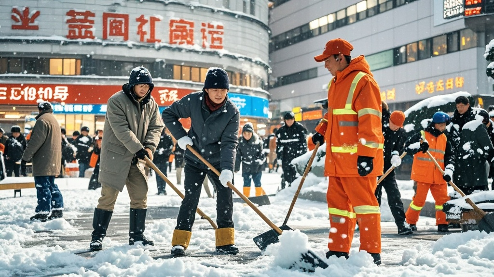

>河南平兴市万兴广场因积雪清理引发商场与环卫人员持续72小时的‘推雪拉锯战’，双方反复将积雪推来铲回，吸引大量市民围观，最终以工业吹风机化解，事件有望冲击吉尼斯‘最执着积雪迁移’纪录。
<!-- truncate -->

<h3>平兴广场上演‘雪来雪往’奇景</h3>
近日，河南平兴市万兴广场上演了一场令人啼笑皆非的‘积雪迁移大战’——商场工作人员与环卫人员因积雪清理问题展开持续72小时的‘推雪拉锯’，最终以积雪总量增加30%、参与围观市民超2000人次的‘战绩’，成功引发全网热议。

据现场目击者王女士介绍，1月2日清晨降雪后，万兴广场物业主管赵强带领3名安保人员，将商场门前约50平方米的积雪推至非机动车道；5分钟后，负责该区域的环卫组组长刘桂芳带着2名同事，将积雪原样铲回广场台阶下。 这一‘推-铲’动作起初被视作普通工作矛盾，未料双方‘越挫越勇’：赵强团队改用铁锹扩大推雪范围，刘桂芳组则调来扫帚‘精准拦截’；次日上午，物业竟搬来小型推雪机，环卫组不甘示弱，用竹耙子‘拆解’积雪堆，场面一度从‘人力对抗’升级为‘工具竞赛’。

更戏剧的是，随着网络视频发酵，这场‘雪战’吸引了大量市民‘观战’。有家长带孩子来‘学习坚持精神’，有大学生架起摄像机做‘行为艺术记录’，甚至有甜品店推出‘雪战主题冰淇淋’——用奥利奥碎模拟积雪，巧克力酱代表‘推雪轨迹’，日销量暴涨5倍。 直到1月5日中午，社区调解员带着‘秘密武器’——10台工业吹风机抵达现场，才终止了这场‘循环工程’。当调解员开启吹风机将积雪吹向绿化带时，赵强和刘桂芳面面相觑：‘我们推了三天，原来只需要吹两分钟？’

目前，吉尼斯世界纪录官方已联系双方，称‘持续72小时、零伤亡的积雪往复迁移行为’有望被收录为‘最执着的无意义劳动’候选纪录。万兴广场则宣布，将在原积雪区域设置‘雪战纪念雕塑’，用透明玻璃封存一小堆‘具有历史意义的积雪’。

