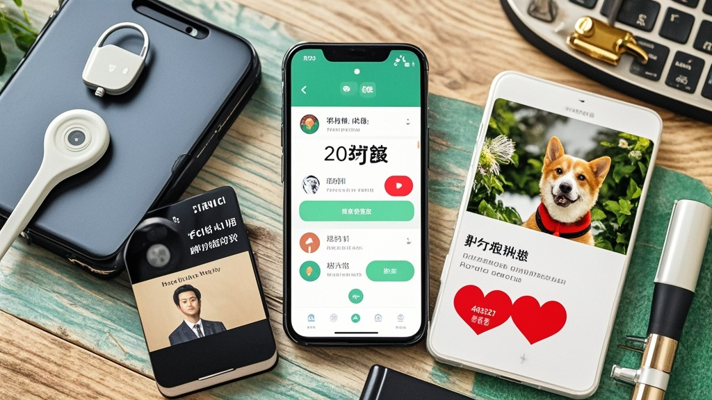

>防偷听新规实施首日，"贴心小秘"APP为严格合规关闭所有监听功能，转而通过定位数据‘脑补’用户需求，因算法误判推送‘宠物殡葬’‘离婚律师’等奇葩服务，引发超10万用户投诉，相关部门介入指导企业正确理解新规。
<!-- truncate -->

1月11日，《互联网应用程序个人信息收集使用规定（征求意见稿）》实施首日，一款名为"贴心小秘"的生活服务类APP意外登上热搜——不是因违规偷听，而是因"太规矩"遭超10万用户集体投诉。

北京用户王女士向记者展示手机截图："昨天我只是在小区里遛了个弯，APP突然推送‘检测到您需要宠物殡葬服务，推荐3公里内四家陵园’。可我连猫都没养过！"更离谱的是，上海的张先生称，他在公司茶水间站了两分钟，APP竟弹出‘检测到您需要法律咨询，推荐离婚诉讼律师’——而他刚和妻子庆祝完结婚五周年。

面对质疑，"贴心小秘"所属的智联科技公司紧急发布声明："为严格落实新规，我们已全面关闭语音唤醒、环境音采集等功能。但为保持用户粘性，技术团队连夜上线‘智能需求预测系统’，通过分析用户历史定位数据生成服务推荐。"

该系统的运行逻辑令人啼笑皆非：用户在超市停留超10分钟→推送母婴用品（默认买奶粉）；经过健身房→推送减肥药（默认减肥需求）；路过民政局→推送婚庆服务（默认结婚需求）。技术总监陈工坦言："我们不敢真的监听，只能让算法‘脑补’，没想到会这么离谱。"

互联网安全专家李哲宁教授分析："新规本意是保护用户隐私，但部分企业出现‘防御性创新’——为规避风险直接关闭必要功能，反而影响用户体验。这就像为防小偷拆了所有窗户，结果屋里闷得慌。"

截至发稿，国家网信部门已介入指导，要求企业正确理解"不得偷拍偷听"的边界，强调"合理的功能需求与隐私保护并不矛盾"。智联科技表示将连夜回滚"预测系统"，暂时恢复基础定位服务，承诺"下次创新前先找用户开座谈会"。

