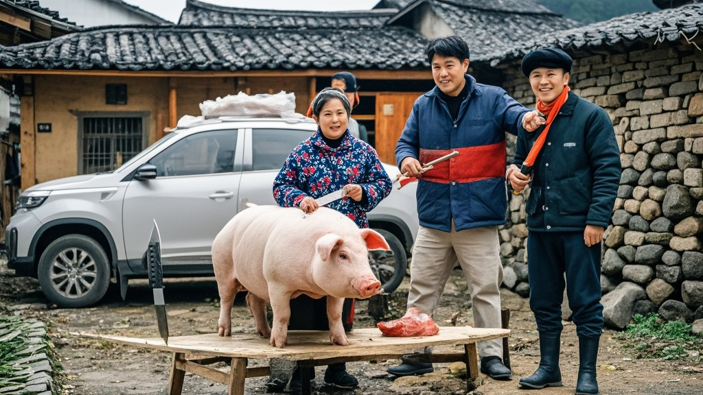

>重庆村民王二花因不会杀猪在社交平台求助，意外引发2000名‘热心刀客’驱车赶赴现场，30万人在线围观‘杀猪教学直播’。网友自带专业工具比拼刀法，评论区涌现‘超声波杀猪’‘猪情绪管理’等荒诞建议，村委会紧急增设‘杀猪指导专线’应对，最终因直播带动土猪肉销量暴涨。
<!-- truncate -->

<h3>本报重庆讯（记者 赵铁柱）</h3>
近日，巴南区接龙镇村民王二花在社交平台发布的一条‘不会杀猪求帮忙’的求助信息，意外引发一场全民参与的‘乡村刀法狂欢’。截至发稿，已有超2000名‘热心刀客’驱车赶赴现场，更有30万人在线围观这场‘杀猪教学直播’，场面一度失控至村委会紧急增设‘杀猪指导专线’。

据王二花介绍，家中养了3年的5头‘过年猪’已到出栏期，但因丈夫外出务工、自己从未接触过屠宰，她在短视频平台发布‘求会杀猪的师傅帮忙，管饭管烟’的消息。谁料消息发出2小时后，村口小路便被挂着‘专业屠宰’‘祖传刀法’‘酒店主厨’等横幅的车辆堵得水泄不通。

‘有带德国进口杀猪刀的，有扛着祖传百年杀猪凳的，还有退休老屠夫带着徒弟来‘踢馆’的！’村民李婶回忆，现场甚至出现‘擂台区’——两位自称‘川渝杀猪王’的师傅当场比拼，一位用‘快准狠’三刀放血法，另一位则演示‘沉浸式杀猪教学’，边操作边讲解‘猪的情绪管理’。

更令王二花始料未及的是，直播热度飙升至30万在线时，评论区突然涌现‘云指导’热潮：有建议用‘超声波杀猪法’的科技爱好者，有主张‘音乐舒缓法’的宠物博主，甚至有养生专家呼吁‘杀猪前先给猪做10分钟八段锦’。

面对失控场面，接龙镇村委会紧急介入：一方面协调村民腾出晒谷场作为‘临时屠宰区’，另一方面开通‘023-88886666’杀猪指导专线，由镇农技站工作人员轮流接听，专门解答‘杀猪工具推荐’‘猪肉保存技巧’等问题。

‘我们统计了下，今天光帮忙的网友就吃掉80斤腊肉、100个馒头，还顺走20斤猪下水当‘教学材料’。’村委会主任李铁柱哭笑不得，‘不过也算因祸得福，村里的土猪肉通过直播卖出2000斤，王二花家的猪还没杀完，订单已经排到元宵节了。’

截至11日晚8点，王二花的求助账号已涨粉5万，她在最新动态中表示：‘原本担心没人来，现在愁的是刀不够磨、盆不够装——下次杀猪前，我一定先开个‘杀猪资格审核’，只让带营业执照的师傅来！’

