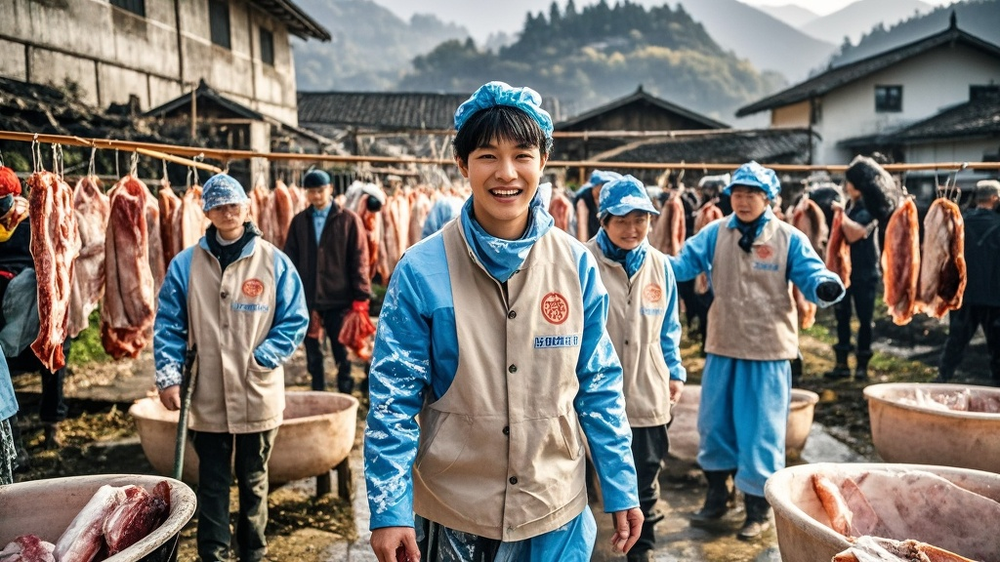

>重庆合川"千人帮杀猪"活动引发连锁反应，参与网友从帮忙杀猪延伸至组建"擦桌洗碗志愿军团"，配备统一装备并开展专业清洁分工，队长称未来计划扩展至帮晒腊肉等乡村服务，荒诞场景令村民既感动又哭笑不得。
<!-- truncate -->

近日，重庆合川云门街道的"千人帮杀猪"事件持续发酵，继千名网友跨城帮忙按住猪崽后，现场竟衍生出令人啼笑皆非的新现象——参与网友自发组建"擦桌洗碗志愿军团"，将乡村坝坝宴的清洁工作推向"专业级"。

据现场目击者王阿姨介绍，11日杀猪活动结束后，原本预计要忙到深夜的清洁现场突然涌入数十名佩戴红袖章的年轻人。"他们举着'洗碗不喊累，擦桌不掉队'的横幅，有人背着定制清洁包，里面连纳米海绵和食品级洗洁精都备齐了！"

记者在现场看到，这支特殊队伍统一穿着印有"合川清洁侠"字样的蓝色马甲，为首的张队长（网名"洗碗小能手"）正用喇叭指挥分工："1组负责清理灶台油垢，2组专攻八仙桌缝隙，3组重点处理院坝猪毛！"更令人咋舌的是，队伍中竟有3名网友现场演示"油污快速分解三步骤"，声称是出发前专门观看了家政培训视频。

问及为何从"杀猪侠"转型"清洁侠"，张队长掏出手机展示聊天记录："昨晚群里有人说'杀猪我们行，收拾摊子不能掉链子'，结果200人的群里有150人报名。现在我们连排班表都做好了，每天留30人轮值，保证村民顿顿有干净碗筷用。"当被追问下一步计划时，他神秘一笑："听说村里过两天要晒腊肉，我们正联系卖竹匾的商家赞助呢！"

面对这波"热情过度"的网友，活动发起人呆呆既感动又无奈："本来只需要帮忙按猪，现在不仅猪杀了，连锅碗瓢盆都锃光瓦亮，我妈说厨房比过年大扫除还干净。"村民刘大爷则摸着被擦得反光的石磨感叹："活了60年，头回见擦桌子还要戴手套的，比我们娶媳妇摆酒还讲究！"

截至发稿，这支"清洁军团"已清理碗碟3000余件，擦洗桌椅120张，更有热心网友在二手平台发起"为乡村清洁助力"募捐，目前已收到200余套清洁工具。有网友调侃："建议申请非物质文化遗产——合川杀猪清洁一条龙服务。"

