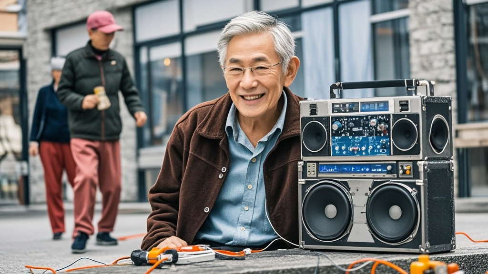

>苏州多地1月13日出现的不明巨响调查结果揭晓，原是一位退休工程师自制'广场舞声波增强器'测试时电路过载，引发低频声波共振所致。该设备由汽车音响、功放等部件组装而成，因功率过大产生闷响，导致居民窗户震动。目前设备已被封存，社区将开展老年发明安全指导活动。
<!-- truncate -->

1月13日中午，苏州市姑苏区、吴中区等多地居民听到的'轰隆'巨响终于有了官方调查结果。据新成立的'苏城异响联合调查组'今日发布的通报，这起引发全城热议的'神秘巨响'，竟源于一位退休工程师的'老年娱乐创新实验'。

<strong>居民回忆：窗户震动如地震，宠物反应激烈</strong> 姑苏区双塔街道居民王阿姨向记者描述：'当时正给孙子喂饭，突然'轰'的一声，窗户玻璃嗡嗡响，吊灯晃得像钟摆，小孙子吓得把碗都摔了。'吴中区某小区的李女士补充：'我家柯基犬平时天不怕地不怕，当时直接钻到沙发底下，尾巴夹得比过年放鞭炮还紧。'

记者走访发现，多数居民最初猜测是地震、施工爆破或飞机音爆，但市地震局13日14时已辟谣称'全市无地震监测数据'，住建部门也确认'周边5公里内无爆破作业'，民航部门则表示'未记录到异常音爆事件'。

<strong>调查反转：退休工程师的'创新实验'惹祸</strong> 联合调查组组长陈工介绍，通过调取周边37个监控摄像头、走访200余户居民，最终锁定声源来自工业园区某老旧小区2栋302室。 '当事人张某，68岁，退休前是电子设备工程师。'陈工翻开调查笔记，'张大爷自述为解决广场舞音乐'传不远'的问题，耗时3个月自制了'广场舞声波增强器'，13日中午正在阳台测试设备功率。'据现场勘查，该设备由6个汽车音响喇叭、2台家用功放和自制电路主板组成，最大功率可达800瓦。'测试时电路瞬间过载，产生的低频声波通过空气共振，最终形成了居民听到的'闷响'。'张大爷在接受采访时挠头苦笑：'本来想给跳广场舞的老姐妹们一个惊喜，谁知道这玩意儿劲儿这么大。'

<strong>后续处理：设备已封存，社区将组织'老年发明安全沙龙'</strong> 目前，张大爷的'声波增强器'已被相关部门登记封存。社区负责人表示，将联合街道科协开展'老年创意发明安全指导'活动，避免类似事件再次发生。 姑苏区文旅局也趁热打铁推出'银发创新科普展'，首展将展示张大爷的'问题设备'，并邀请专家现场讲解'家庭自制设备安全规范'。

