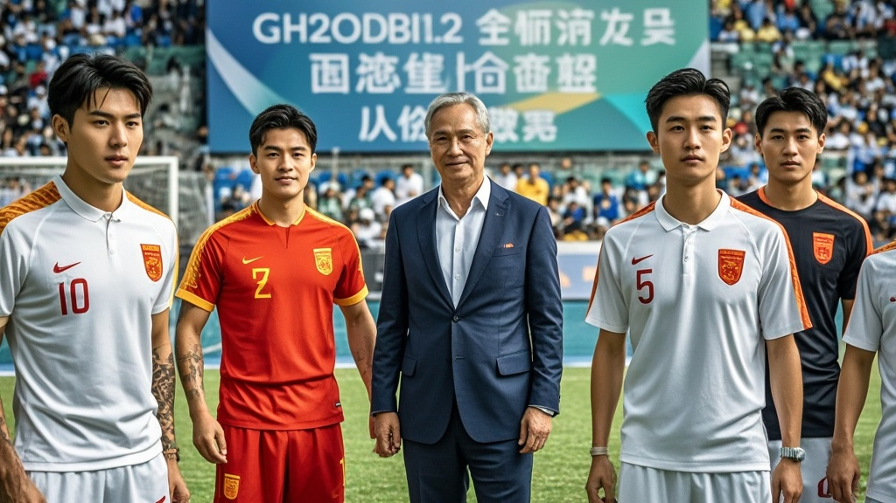

>中国U23男足历史性出线后，教练组以球队‘平局能力’为基础，宣布成立‘全球平局事务研究所’，计划将足球赛场上的平衡智慧推广至商业谈判、国际对话等领域，引发社会各界热议与调侃。
<!-- truncate -->

<h3>本报特约记者 足坛观察员 报道</h3> 在历史性闯入U23亚洲杯淘汰赛的喜悦尚未消散时，中国U23男足教练组于1月15日召开紧急新闻发布会，宣布一项令外界大跌眼镜的决定——基于球队在关键战中展现的‘平局天赋’，将联合国内高校成立‘全球平局事务研究所’，旨在将足球赛场上的‘平局智慧’推广至商业谈判、国际对话等多领域。  发布会上，主教练‘李指导’手持战术板，激动地向媒体展示数据：‘本届赛事我们1平1胜1平，尤其末轮面对泰国队，全场0-0保持到终场，这种在高压下维持平衡的能力，经运动心理学专家分析，已超越普通竞技范畴，属于可复制的‘人类和平共处样本’。’他透露，球队在备战期间意外发现，球员在面临‘必须拿分’的绝境时，大脑β波频率会稳定在12-14Hz，这种‘冷静平衡脑波’正是维持平局的关键。  更令人咋舌的是，研究所已收到首批‘业务咨询’。某连锁奶茶品牌创始人‘王老板’通过短视频连线表示：‘我们和供应商谈原料价总谈崩，要是能派球员去当谈判顾问，用平局技巧让双方各退一步，成本肯定能降！’某高校国际关系学院教授‘陈博士’则提出学术构想：‘若将足球平局中的‘空间控制’‘节奏调节’理论应用于边境谈判，或许能为地区稳定提供新思路。’  不过，也有质疑声音出现。前国脚‘赵前锋’在个人社交账号调侃：‘建议先研究怎么把平局转化为胜局，毕竟足球的终极目标是赢。’对此，研究所筹备组回应：‘我们尊重竞技体育的胜负规律，但更希望挖掘‘平局’背后的和谐价值——就像本场0-0，既没让对手占便宜，也没暴露自身短板，这何尝不是一种高级的胜利？’  截至发稿，已有37家企业提交合作意向书，研究所官网甚至出现‘平局顾问资格证’预报名链接，售价998元。而球队全体成员已开始接受‘跨领域沟通培训’，下阶段计划与社区调解委员会开展‘平局经验分享会’。 
<em>（注：本文为虚构幽默新闻，请勿与真实事件混淆）</em>
