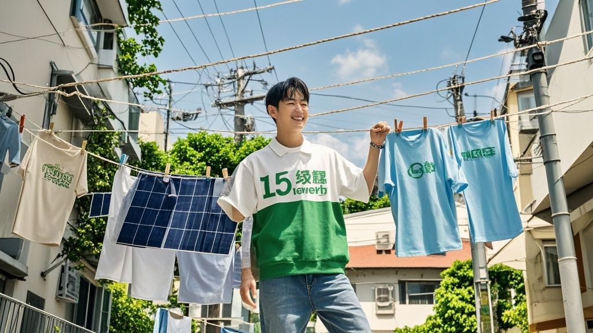

>国家电网宣布'十五五'4万亿新能源投资后，民间掀起'全民绿能'热潮。因正规材料短缺，部分市民竟用晾衣绳充当导电线，社区出现'晾衣绳电力革命'，电商平台借机推出'电力革命套装'，国家电网紧急提醒安全规范仍难阻民间创新热情。
<!-- truncate -->

<h3>国家电网宣布'绿能超人计划'后引发连锁反应</h3> 据《电力观察报》报道，国家电网近日宣布'十五五'期间将投入4万亿元用于新能源建设的消息，在民间引发意想不到的'电力狂欢'。  记者走访发现，自公告发布次日起，全国五金店的电线、电表、太阳能板等材料销量激增300%，更出现戏剧性场景——由于正规电线供不应求，部分市民竟将家中晾衣绳剪下充当'临时导线'，美其名曰'低碳再利用'。  在杭州西湖区某老小区，68岁的退休电工王大爷向记者展示他的'创新成果'：'我把阳台的不锈钢晾衣绳接上微型逆变器，现在能给楼道声控灯供电了！'说着他轻轻拍手，原本需要插电的声控灯果然亮了起来，不过灯泡闪烁频率明显加快，'可能是电阻不太匹配，得再调调'。  社区物业经理李女士对此既无奈又好笑：'这两天每天接到20多起咨询，问能不能在公共区域装风力发电机。更夸张的是，有住户在单元楼顶搭起'竹竿光伏阵'，说要'响应国家号召'。'她指着窗外几根绑着太阳能板的晾衣杆，上面还挂着'全民绿能 人人发电'的红布横幅。 
国家电网紧急回应：家庭发电需专业操作  针对愈演愈烈的'民间电力热'，国家电网发言人张能源今日通过官微发声：'我们完全理解大家参与新能源建设的热情，但家庭微电网建设需符合安全规范，随意改造可能引发短路风险。'他特别提醒：'晾衣绳导电性有限，且多为金属材质易生锈，不建议作为导电线使用。'  然而这一提醒似乎适得其反。记者在某短视频平台看到，#晾衣绳电力革命#话题播放量已破千万，其中点赞最高的教程视频展示了'如何用晾衣绳+充电宝+LED灯打造应急照明系统'，配文称'响应4万亿号召，从自家阳台开始'。  更有商业嗅觉敏锐的商家迅速跟进——某电商平台出现'电力革命套装'，包含晾衣绳、简易逆变器和教学手册，上线3小时即售罄5000套。客服人员透露：'很多买家备注要'支持国家大项目'，还有人问能不能开发'竹竿版'。' 
专家：荒诞背后是民众参与感觉醒  能源经济学者陈光远分析：'4万亿投资规模确实震撼，民众将其理解为'全民参与的能源革命'虽有偏差，但反映出对绿色转型的积极态度。'他建议相关部门应加强科普，'与其禁止，不如引导民众通过正规渠道参与分布式光伏项目'。  截至发稿，国家电网已开通'民间绿能建议通道'，并计划在社区开展'安全用电小课堂'。而记者在采访结束时，恰好看到两位大爷蹲在小区花园里研究'用竹篱笆装风力涡轮机'的可行性——这场由4万亿投资引发的'民间电力实验'，似乎才刚刚开始。
