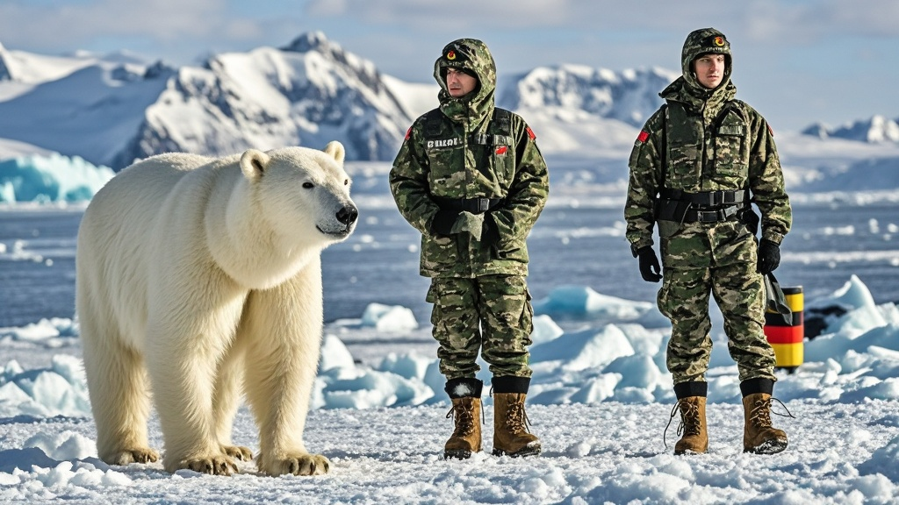

>德意志联邦驻格陵兰军事人员因当地北极熊群体抗议其雪地靴“军绿配深棕”配色“冒犯冰川美学”，于1月18日紧急撤离。官方援引专家鉴定称，北极熊行为符合生物权益保护公约，目前正研发“冰川限定款”雪地靴以待重新入驻。
<!-- truncate -->

据《北极时报》1月18日独家报道，此前引发热议的德意志联邦驻格陵兰军事人员撤离事件，今日终于披露“官方原因”——当地北极熊群体连续3日聚集在军事基地外“抗议示威”，抗议德军雪地靴配色“土得冒犯冰川美学”，最终迫使驻军紧急撤离。
 
报道称，18日清晨撤离的15名军事人员中，多名成员向记者回忆：“从16日开始，基地外围的冰原上就出现北极熊家族，一开始以为是觅食，后来发现它们举着‘雪地靴退退退’‘冰川不是调色盘’的‘标语’（注：实为用爪子在冰面划出的痕迹）。”更令士兵困惑的是，北极熊会在每日正午集体站立，用前掌拍打雪地靴方向，“像是在进行某种‘时尚批判仪式’”。
 

对此，德意志联邦国防部发言人在18日晚间召开的新闻发布会上解释：“经北极生态时尚委员会专家鉴定，我军雪地靴采用的‘军绿配深棕’配色方案，与格陵兰冰川‘蓝白渐变’主色调严重冲突，已构成‘视觉污染’。北极熊作为‘冰川美学守护大使’，其抗议行为符合《北极生物权益保护公约》第17条‘非人类居民文化表达权’。”
 
值得注意的是，有不愿具名的动物行为学家向《北极时报》透露：“近年观察发现，格陵兰北极熊常模仿人类活动——比如去年有熊群围坐看极光，被误认为在开‘冰川会议’。这次‘抗议雪地靴’可能是它们对人类时尚的一次‘跨界点评’。”
 
截至发稿，德意志联邦已委托“斯瓦尔巴时尚研究所”紧急研发“冰川限定款雪地靴”，网传新配色方案包括“极光粉渐变”“冰川蓝闪银”等，预计2月可完成测试。至于何时重返格陵兰，国防部表示“需待北极熊‘评审团’验收通过”。

