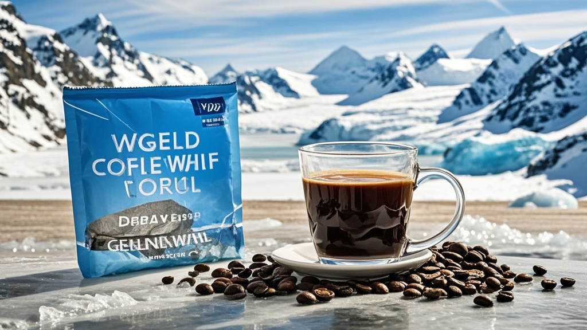

>世界经济论坛2026年年会因'冰川融水咖啡'引发丹麦代表团抗议退场，格陵兰自治政府随即推出'冰川WiFi'反击，导致会场陷入'数字冰川热'，最终经协调咖啡下架、WiFi关闭，闹剧收场。
<!-- truncate -->

<h3>世界经济论坛2026年年会现戏剧性插曲</h3> 据达沃斯当地媒体《阿尔卑斯时报》19日报道，正在瑞士举行的世界经济论坛2026年年会突发离奇事件——丹麦代表团以'冰川融水咖啡涉嫌领土争议'为由集体退场，而格陵兰自治政府随后推出的'冰川WiFi'更导致会场陷入'数字冰川热'，原定的'全球气候治理'分论坛被迫改为'冰品与网络的奇幻联动'特别讨论。 
 <strong>争议起于一杯咖啡</strong> 论坛主办方为体现环保理念，特别推出'冰川之味'限定饮品，宣称使用'格陵兰岛纯净冰川融水'制作。丹麦代表团团长英格丽·冰鳍女士在品尝后突然提出抗议：'我们有充分证据显示，这些融水取自丹麦与格陵兰争议区域的冰川，这是对我国领土主权的冒犯！'随即率12名随员离开主会场。  <strong>格陵兰反击：推出'冰川WiFi'</strong> 格陵兰自治政府发言人约纳斯·雪鸥当天下午回应称，'既然丹麦朋友如此在意冰川，我们决定赠送达沃斯一份特别礼物'——现场突然响起提示音，所有参会者手机自动连接上名为'GLACIER-WIFI'的网络。连接后界面显示：'欢迎访问格陵兰数字冰川，每在线10分钟可领取1块虚拟冰川纪念块，集满100块可兑换真实冰川融水（取自非争议区域）！'  <strong>会场陷入'抢冰'热潮</strong> 这一操作导致论坛现场出现奇观：原本讨论人工智能的分论坛，变成'如何快速集冰川'经验交流会；原计划的企业领袖对话环节，多位CEO举着手机展示'已集87块'的界面；甚至有参会者因抢连WiFi撞翻了茶歇台的'冰川融水咖啡'。  <strong>闹剧收场：咖啡下架，WiFi关闭</strong> 论坛组委会紧急召开闭门会议，最终决定：立即撤下所有'冰川融水咖啡'，改用瑞士本地山泉水；联系格陵兰方面关闭'冰川WiFi'，并承诺'未来将严格审核饮品水源地证明'。丹麦代表团在收到'水源无争议'书面保证后，于晚间返回会场。  截至发稿，世界经济论坛官方微博发布趣图：一只北极熊举着'达沃斯WiFi已关闭，大家请专注讨论'的牌子，配文：'今天的小插曲，让我们更懂——冰川既要保护，议程也要推进！'
