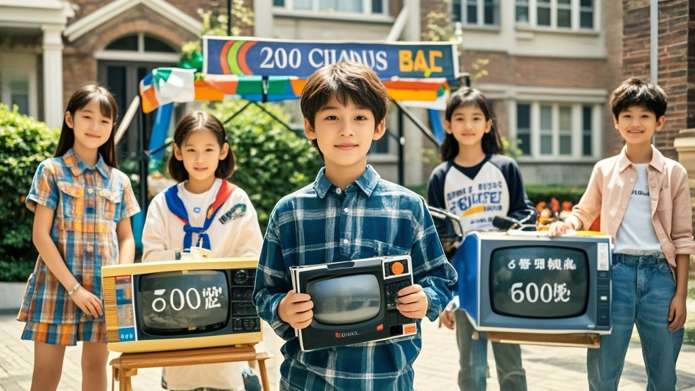

>11岁男孩将修电视赚的6000元投入，在小区成立‘儿童商管公司’，提供摊位租赁、代跑腿等服务，拉同学组成‘团队’，推出‘创业贷’等‘业务’，引发家长和物业关注。
<!-- truncate -->

近日，我市某小区上演‘儿童商业帝国’扩张新戏码——曾因打碎电视屏在小区创业筹钱的11岁男孩小宇（化名），宣布将此前赚得的6000元‘启动资金’全部投入，在小区内注册成立‘小宇儿童商业管理有限公司’（简称‘小宇商管’），引发业主热议。

据记者实地探访，‘小宇商管’办公地点设在小区儿童游乐区旁的凉亭，墙上贴着手写的‘公司愿景：帮小朋友赚钱，让大朋友省心’，桌上摆着计算器、收款二维码和一摞‘商业合作意向书’（实为作业本纸自制）。小宇穿着印有‘CEO’字样的卡通围裙，正用儿童手表接听‘业务咨询’：‘王阿姨家的朵朵想卖手工发卡？没问题，我们抽成15%，提供摊位和广告服务；李叔叔家的淘淘要代取快递？每单收1元管理费，我们有专业的‘跑腿小队’。’

回顾创业历程，小宇妈妈程女士既骄傲又无奈：‘最开始只是让他体验赚钱辛苦，谁知道他用卖手抓饼、代遛狗、教小朋友拼乐高的钱，不到俩月真凑够了修电视的钱。现在更离谱，说要学‘商业大佬’搞生态，还拉了小区5个同学当‘部门经理’，什么‘市场部’负责画海报，‘财务部’管记账——昨天还跟我说要给‘员工’发‘股权’，用积分兑换冰淇淋。’

小区物业负责人张先生表示已关注到这一‘商业现象’：‘我们贴了通知提醒家长监管，可孩子们积极性太高了。昨天有业主反映，‘小宇商管’推出了‘儿童创业贷’——用零食抵押借启动资金，日息1颗糖。这哪是小孩过家家，简直是迷你版‘商业综合体’。’

儿童教育专家李教授听闻后哭笑不得：‘我研究儿童经济学多年，没见过这种‘无师自通’的商业模式。建议家长引导孩子理解‘商业’与‘游戏’的边界，毕竟…小区快递柜可不是儿童创业园的‘共享仓储’。’截至发稿，‘小宇商管’已签下8单‘合作项目’，小宇正计划用首月利润‘给员工涨工资’——每人奖励一包辣条。

