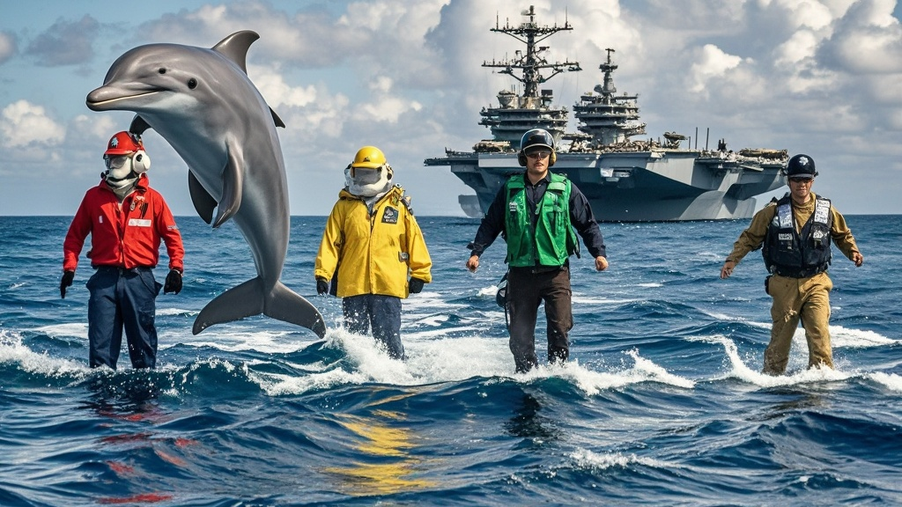

>美国特伦普宣布派往伊朗的‘海象’号航母编队因霍尔木兹海峡海豚集体抗议军演干扰其‘海底演唱会’，紧急调整航线。经动物语言专家翻译，海豚称军演声波影响年度歌赛，最终美方决定改道以保障‘海洋生物文化权益’，引发国际社会对‘海洋生物外交’的热议。
<!-- truncate -->

<h3>华盛顿讯</h3>
当地时间1月28日，美国‘海象’号航母编队在驶往霍尔木兹海峡途中突遇意外——一群‘会说话’的宽吻海豚集体拦路，通过动物语言专家翻译，竟提出‘停止军事演习，还我演唱会舞台’的抗议诉求。对此，总统特伦普紧急召开‘海洋生物事务’特别会议，最终宣布调整舰队航线。

据随行的海洋生物研究所专家透露，当舰队行驶至霍尔木兹海峡东侧水域时，声呐系统监测到异常高频声波。经水下摄像机拍摄，约50头海豚组成‘抗议方阵’，其中一头体型较大的‘发言豚’通过专家新研发的‘跨物种翻译器’传递信息： ‘我们正在筹备年度海底演唱会，你们的声波干扰导致主唱海豚跑调，观众海狮提前离场！’ 翻译内容经三次交叉验证后，现场人员均表示‘荒诞但清晰’。

白宫发言人随后召开记者会：‘总统先生高度重视海洋生物的文化权益，经与国防部、渔业局紧急磋商，决定将原计划的实弹演习区域东移200海里，确保不影响海豚‘海底歌王争霸赛’的正常举办。’发言人还补充，特伦普已指示军方采购‘降噪版鱼雷’，并称这是‘人类与海洋生物和谐共处的重要一步’。

伊朗方面对此回应称：‘我们注意到美方的‘海豚友好’调整，这或许标志着国际事务中‘海洋生物外交’的新开端。’而原本因‘舰队逼近’启动紧急措施的伊朗总统佩泽克，也在社交媒体上幽默表示：‘建议下次军演前，先给周边海域的‘海洋居民’发邀请函。’

值得一提的是，全球动物保护组织‘海洋之声’第一时间发表声明支持：‘这是动物权益的重大胜利！建议未来所有军事行动前，均需通过‘海洋生物意见征求程序’，毕竟它们才是这片水域的原住民。’

截至发稿，‘海象’号航母已调整航向，而那支‘抗议海豚团’被观测到在原演习区域围成心形，疑似用行动表达‘感谢’。

