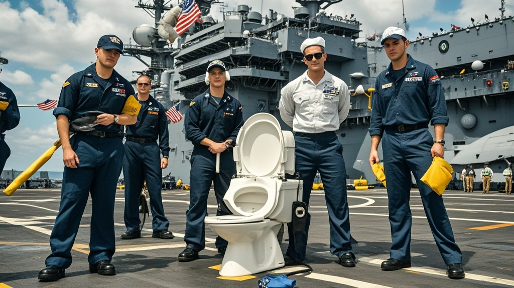

>美国'海神之跃'号航母因48小时内208次马桶堵塞故障紧急返港，水兵集体抗议签署《如厕安全白皮书》，维修队尝试多种奇葩疏通方法未果，海军计划安装太空级马桶系统并提供岸上如厕福利。
<!-- truncate -->

据美国海军内部消息人士透露，当地时间1月28日，被称为'海上堡垒'的'海神之跃'号核动力航母在大西洋演习途中突然改变航向，以25节最高航速紧急返回弗吉尼亚母港。此次'紧急行动'既非遭遇敌方威胁，也非设备重大故障，而是因舰上马桶系统在48小时内发生208次堵塞故障，引发全体水兵强烈抗议。

记者从不愿透露姓名的水兵代表'汤姆'处了解到，自1月26日起，舰上128间公共卫生间陆续出现'冲水无力-管道堵塞-反味蔓延'的恶性循环。'起初只是几间马桶不通，后来连军官专用厕所都堵了。昨天早餐时，三等兵杰克刚端起燕麦粥，隔壁就传来'噗'的一声——您猜怎么着？他的碗里飘进了半片厕纸！'汤姆边比划边说，语气中带着难以抑制的崩溃。

更戏剧性的是，舰上工程维修队为解决问题可谓'八仙过海'：先用酸性溶液清洗管道（每次成本约40万美元），发现效果不佳后，竟尝试用咖啡渣、碎冰甚至儿童玩具'通乐圈'疏通。有水兵调侃：'现在维修舱比超市货架还热闹，从通厕灵到 plunger（皮搋子），连舰长夫人送的圣诞巧克力都被拿来当'润滑剂'了！'

面对持续恶化的卫生危机，200余名水兵于27日晚集体签署《海神之跃号如厕安全白皮书》，要求'立即返港检修，否则拒绝执行任何非如厕相关任务'。一位参与签署的下士向记者展示文件，其中赫然写着：'我们可以忍受50小时连续执勤，但无法忍受在执勤间隙被马桶水溅到脚踝！'

美国海军发言人在29日的新闻发布会上尴尬回应：'经初步调查，故障主因是部分水兵违规丢弃'非可冲散物品'，包括但不限于：未溶解的蛋白粉袋、宠物狗的玩具球（注：该航母允许军官携带宠物）、以及某三等兵私藏的'神秘橡胶制品'。目前我们已联系邮轮公司专家，计划为'海神之跃'号安装'太空级真空马桶系统'，预计维修期为3个月——当然，在这期间，水兵们将优先获得岸上'星级厕所体验券'。'

