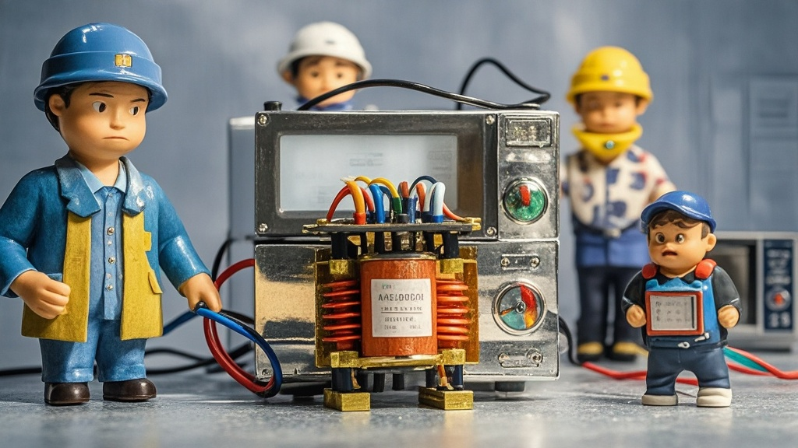

>全球变压器短缺引发民间替代热潮，部分居民将微波炉变压器改装为家用升压设备，电商平台涌现二手变压器交易，甚至出现‘古董变压器’高价拍卖。行业协会紧急提醒安全风险，科技企业借机推出‘适配器’概念，引发市场热议。
<!-- truncate -->

近日，随着全球AI算力中心爆发式增长导致的变压器短缺问题持续发酵，一场民间自发的‘变压器替代革命’在多地社区悄然上演。据《环球电气时报》记者走访发现，部分居民为应对家用电路扩容需求，竟将目光投向了厨房电器——微波炉变压器。
 

在上海虹口区某老旧小区，68岁的电工爱好者张师傅向记者展示了他的‘杰作’：一台被拆解的老式微波炉，其高压变压器被改装成小型升压装置，外接在客厅配电箱旁。‘现在市面上买个配电变压器要等半年，我这微波炉变压器才花50块收的，改改就能给电动车充电桩升压，’张师傅边调试边说，‘邻居们都找我帮忙改，昨天刚给3楼老李家装了一台。’
 

这股‘微波炉变压器改造热’并非个例。记者在电商平台搜索发现，‘二手微波炉变压器’关键词下涌现出近千条商品链接，部分商家甚至打出‘工业级替代品’‘算力时代硬通货’等夸张标语。更有甚者，某收藏网站出现‘90年代老式变压器’拍品，标注‘纯铜芯、无维修史’，起拍价高达8888元。
 

针对这一现象，中国电力设备协会紧急发布《关于规范变压器使用的重要提醒》，指出微波炉变压器与工业配电变压器在绝缘等级、负载能力等核心参数上存在本质差异，私自改装可能引发短路、火灾等安全隐患。协会技术顾问李工在接受采访时哭笑不得：‘我们理解用户的迫切需求，但用微波炉变压器给充电桩升压，就像用自行车链条当汽车传动链——看着能转，实则风险极高。’
 

值得关注的是，这场民间热潮已引起部分科技企业的‘灵感’。某智能硬件初创公司负责人透露，他们正在研发‘家用智能变压器适配器’，声称能将微波炉、电磁炉等家电的废弃变压器‘变废为宝’，目前已收到300万元天使轮投资。不过该方案尚未通过任何安全认证，能否落地仍是未知数。
 

截至发稿，全球变压器龙头企业‘积电变’宣布将启动‘旧件回收计划’，承诺以市场价1.5倍回收符合标准的二手工业变压器，但对微波炉变压器明确表示‘不在回收范围内’。

