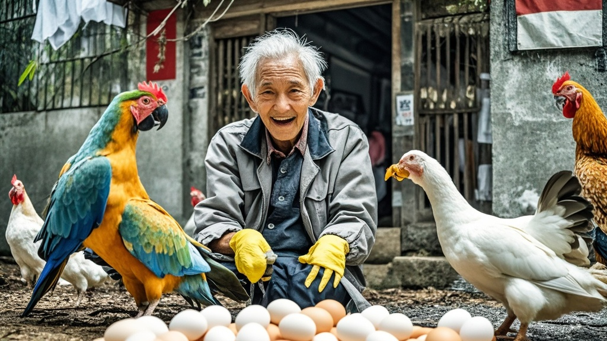

>湖南李守禽老人因养鸡鸭感染鹦鹉热康复后，其女儿处理家禽的行为被邻居转发，引发全城禽类大清洗。居民捕杀、丢弃各类禽类，导致市场禽类断供、鸡蛋抢购，甚至出现追打野生鸟类现象。最终疾控中心紧急辟谣，指出普通接触禽类感染风险极低，这场荒诞的"人禽大战"才逐渐平息。
<!-- truncate -->

近日，湘南候鸟病防治中心接诊的一例特殊病例，意外引发了一场波及全城的"禽类危机"。据患者家属李爱洁女士介绍，其69岁的父亲李守禽因长期饲养鸡鸭，于上月确诊感染鹦鹉热，经治疗本周初康复出院。

"医生说要避免接触禽类，我想着干脆把家里的鸡鸭都处理了，省得再出问题。"李爱洁向记者展示着手机里的照片，画面中原本热闹的后院只剩空荡荡的竹笼。令人意外的是，这段在家庭群里分享的"防疫经验"被邻居转发至社区群后，竟像投入油锅的水滴般迅速扩散。

社区网格员王建国向记者描述了这场"禽类大清洗"的发展轨迹："周一下午三点，1栋张阿姨开始杀自家养的芦花鸡；四点半，3栋刘叔把鸽子笼扛到了垃圾站；五点整，菜市场卖活鸡的老陈接到十个退订电话。"更夸张的是，有居民将目标从"自家禽"扩展到"所有禽"——小区绿化带的麻雀被撒网捕捉，广场上的和平鸽被迫集体"迁徙"至市图书馆顶楼，甚至有小朋友举着玩具枪追打路过的喜鹊。

这场"人禽大战"直接导致本地禽类市场陷入混乱。记者走访发现，连续三日全市菜市场活禽摊点零营业，冷冻鸡鸭肉货架空置率达85%，鸡蛋价格较前日上涨37%仍被抢购一空。某超市负责人苦笑："昨天有顾客把鹌鹑蛋当鸡蛋买走了，今天连观赏鸟饲料都卖断货。"

面对失控的局面，湘南候鸟病防治中心紧急召开新闻发布会。传染科主任张立明用投影仪展示着数据："鹦鹉热主要通过吸入带菌禽类分泌物传播，普通接触健康禽类感染风险低于0.01%。目前全市仅发现1例确诊病例，过度清除禽类反而可能破坏生态平衡。"

截至发稿前，社区已张贴《关于理性对待禽类接触的温馨提示》，部分居民开始将"暂存"在垃圾站的鸽笼往回搬。不过仍有少数"防疫积极分子"坚持："宁可信其有，我家的虎皮鹦鹉已经送去动物园托管了！"

