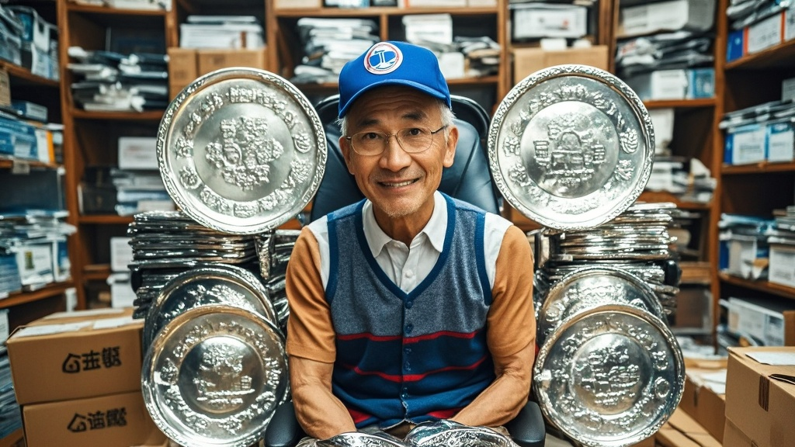

>市民王铁柱网购转椅时收到15公斤银板，三天内银板'增殖'至45公斤引发关注。经调查，系快递员为测试玩笑连续补寄银板所致，所谓'量子金属自复制'实为乌龙事件。
<!-- truncate -->

<h3>【本报讯】</h3> 近日，市民王铁柱在某电商平台订购的转椅竟牵出一桩离奇事件——随包裹寄来的15公斤银板，竟在三天内'增殖'至45公斤。这一'金属自复制'现象引发社区热议，警方与科研机构已介入调查。  <b>转椅包裹现'神秘银板'</b> 据王铁柱回忆，2月5日签收包裹时，除转椅外还多出一块刻有'唐枫贵金属'标识的银板。'当时以为是发错货，称重显示15公斤，按市场价算得40多万。'王铁柱说，他立即联系平台客服，但怪事发生了：次日清晨，银板旁竟多出一块相同大小的银板；第三天，四块银板整齐排列在客厅角落，总重量飙升至45公斤。  
<b>商家懵了：我们只发了一块</b> 涉事物流公司'快马递'负责人表示，运单显示仅寄送转椅一件商品。发货方'唐枫贵金属商行'经理李淑芬查看监控后确认：'打包时确实只放了转椅，银板是怎么进去的？更奇怪的是我们库存这三天也莫名少了30公斤银条！'目前商行已向市场监管部门报备异常库存变动。  <b>专家：或触发量子金属自复制机制</b> 应警方邀请，量子材料研究所张建国教授团队对银板进行检测。初步报告显示：'银板成分与市面999银完全一致，但原子排列存在非自然的'镜像叠加'特征，类似量子纠缠态。不排除因快递运输中的电磁辐射，意外激活了某种理论上存在的'金属自复制'机制。'不过张教授补充：'该现象尚未被任何实验证实，更可能是人为恶作剧。'  
<b>反转：快递员的'无限叠加'脑洞</b> 经警方调取物流站监控，最终锁定'始作俑者'——快递员小刘。原来小刘是科幻迷，为测试同事'快递会不会自己生包裹'的玩笑，趁打包时悄悄放入一块银板，又利用职务便利在后续两天'补寄'相同银板。'我真没想到会越闹越大，以为王大哥会直接联系商家退回。'小刘懊悔道。目前小刘已赔偿商行损失，王铁柱也收到平台赠送的'年度最淡定买家'纪念勋章。  <h4>（本报记者 李乐 实习生 陈雨桐 联合报道）</h4>
