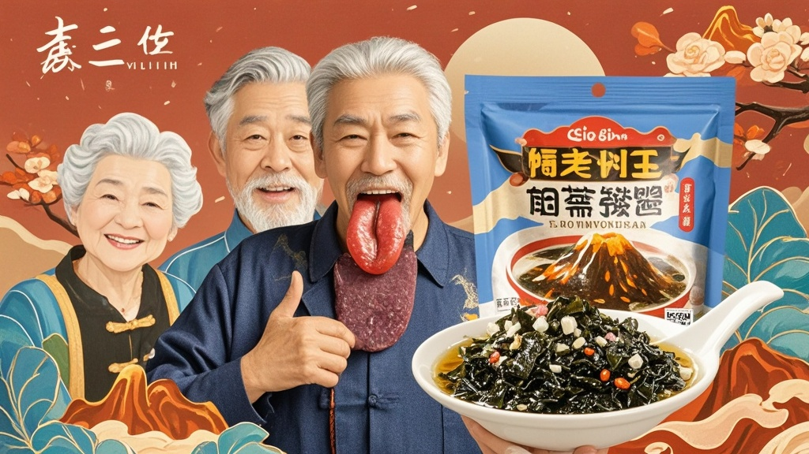

>六旬张建国误将国潮风包装的干燥剂当'火山熔岩黑椒酱'调入紫菜汤，饮用后出现'舌头冒热气'症状，引发社区老人集体误服。经查实为食品企业升级干燥剂包装时模仿网红调料设计，最终企业连夜整改包装并致歉。
<!-- truncate -->

近日，我市朝阳社区上演戏剧性一幕：六旬居民张建国大叔在家煮紫菜汤时，误将包装精美的干燥剂小袋当作'火山熔岩黑椒酱'调入汤中，饮用后竟出现'舌头冒热气'的离奇状况，引发社区老人集体'尝鲜'热潮。

据张叔回忆，2月7日晚他拆开某品牌紫菜包装时，发现除了紫菜包外还有个黑色亮面小袋，袋身印着'火山熔岩·辛辣劲爽'的烫金字体，'现在年轻人都喜欢这种网红调料，我想着给汤加点风味'。煮好汤后他特意多放了两包，喝第一口就觉得'舌尖像冒小火星'，以为是调料效果，直到半小时后喉咙发紧才拨打120。

更戏剧性的是，社区卫生服务中心当晚接诊3位类似症状老人——王淑兰阿姨煮馄饨、李守财大爷泡方便面时都用了同款'调料'。老人们纷纷表示：'这包装比超市卖的调料还好看，谁能想到不是吃的？'社区群里甚至出现'求链接'的留言，几位老人表示'这酱劲大，够味'。

经市场监管部门调查，涉事企业'鲜得乐食品'负责人尴尬解释：'我们本意是升级干燥剂包装防儿童误拆，找设计师参考了网红调料的国潮风，没想到反而让老年人误会。'据了解，该干燥剂成分安全但不可食用，老人们的'冒热气'实为心理作用与辛辣包装带来的感官错觉。

事件发酵后，企业连夜启动包装整改：新包装采用高对比度黄黑配色，印上放大200%的'干燥剂·不可食用'字样，并增加语音提示功能——撕开包装时会播放：'请注意！这是干燥剂，不能吃哦~'目前，企业已为全市10万袋在售紫菜更换包装，并向涉事老人赠送'老年友好型'调料套装致歉。

