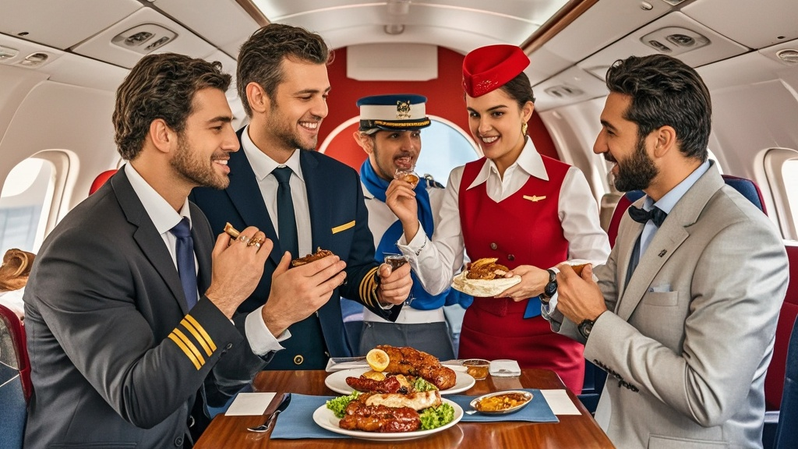

>土耳其安纳托利亚云雀航空一航班因乘客争论烤肉卷正宗性爆发全舱混战，从香料配比吵到现场‘物证展示’，空姐临时当裁判，机长竟宣布‘空中拳击赛’规则，最终航班提前降落雅典处理‘参赛选手’，航空公司称将增设‘美食辩论区’。
<!-- truncate -->

当地时间2月12日，安纳托利亚云雀航空LY789次航班（安塔利亚-曼彻斯特）上演了一场令空乘人员直呼‘活久见’的荒诞戏码——原本计划6小时的航程，因30余名乘客突然爆发的‘烤肉卷正宗性辩论’演变为全舱混战，最终航班被迫提前降落在雅典机场处理‘参赛选手’。

据机上黑匣子录音及乘客事后回忆，冲突起源于17排B座的中年乘客穆斯塔法向邻座艾莎展示手机里的‘祖传烤肉卷秘方’，声称‘只有用安塔利亚红辣椒腌制的羊肉才配叫烤肉卷’。艾莎当场反驳：‘我伊斯坦布尔奶奶用酸奶酱的做法才是正统！’两人从香料配比吵到烤炉温度，音量逐渐盖过机上播放的《土耳其进行曲》。

戏剧性转折发生在空乘送来餐食后——穆斯塔法的餐盘里恰好是羊肉烤肉卷，艾莎则拿到鸡肉款。‘看！连航空公司都支持安塔利亚派！’穆斯塔法举着餐盒高呼，彻底点燃导火索。邻座乘客纷纷加入战局：32排的面包店老板掏出手机展示‘2025年伊斯坦布尔烤肉卷大赛冠军证书’，5排的游客翻出三年前在安塔利亚老店的消费凭证，甚至有人从行李舱取出家乡产的辣椒面现场‘物证展示’。

混战升级时，3名空姐竟临时‘转型’裁判：一位举着餐车当隔离带，两位用对讲机喊着‘左舷乘客出拳有效！右舷注意别碰翻饮料车！’。最离谱的是机长通过广播宣布：‘为保障安全，现开启临时规则——每排推举1名代表到过道对决，胜者所在区域可优先下机领取道歉礼包。’此言一出，原本观望的乘客竟自发组队，连80岁的退休教师都系紧安全带表示‘要为开塞利烤肉卷正名’。

最终，雅典机场紧急调配12名安保人员上机，用巧克力威化和土耳其软糖才将情绪激动的乘客劝服。云雀航空事后声明：‘已将本次事件列为年度安全培训案例，未来将在餐食菜单标注“可能引发文化讨论”提示，并考虑在机上增设“美食辩论区”。’

